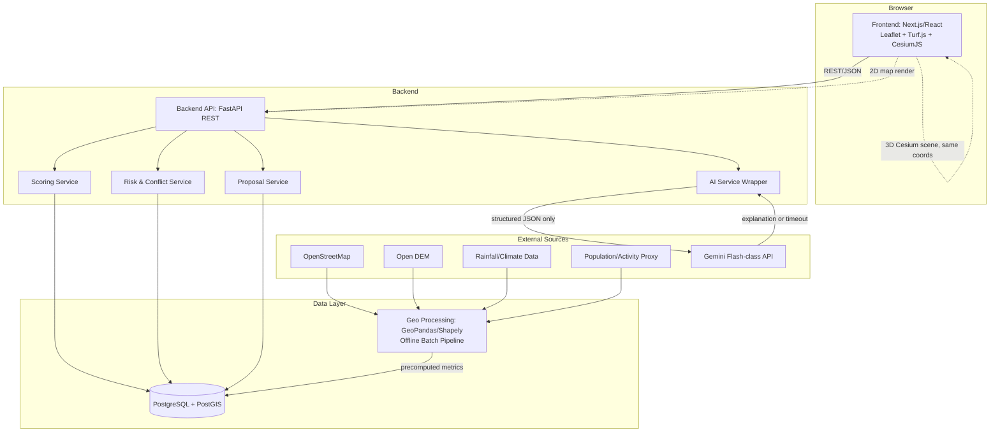
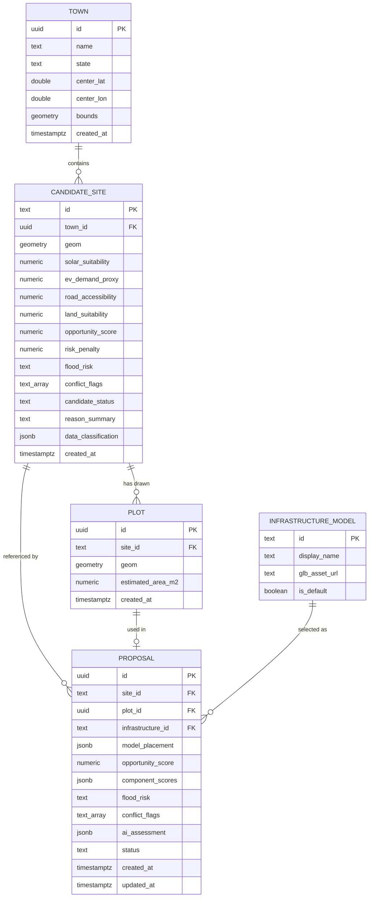

# URJASETU — ARCHITECTURE + DATABASE + API SPECIFICATION

**Document Status:** DRAFT v1.0 — Implementation Contract
**Source of Truth Priority:** (1) PRD, (2) TRD, (3) URJASETU_MASTER_BRIEF.md, (4) Original brief + 3D+AI Add-On
**Project:** UrjaSetu
**Primary Demo City (this document):** Nashik, Maharashtra, India
**Primary Infrastructure:** Solar-EV Charging Hub
**Primary User:** Municipal / ULB planning officer

This document converts the approved TRD into precise, unambiguous implementation contracts — exact schemas, exact API payloads, exact data flows — sufficient for a development team (or an AI coding agent) to implement the system without making architectural decisions of their own. It introduces no new product features and does not change the approved workflow. No application code, Google Stitch prompts, or Antigravity prompts are included here.

---

## ⚠️ DOCUMENT-LEVEL CONTRADICTION NOTICE

The PRD, TRD, and Master Brief all specify **Kopargaon** as the primary demo town. This task's instructions specify **Nashik, Maharashtra** as the primary demo city for this document, with Pune as an optional secondary example. This is a direct contradiction between upstream documents and this task's instructions.

Per the "identify, don't silently change" rule, this is flagged explicitly here rather than silently resolved. This document proceeds using **Nashik as the primary demo dataset**, as explicitly instructed for this deliverable, while preserving every architectural principle from the PRD/TRD/Master Brief unchanged (scoring model, risk logic, workflow order, terminology, AI guardrails, non-goals). The only change is *which town's data populates the demo dataset* — the architecture itself was already designed in the TRD to be city-agnostic (Section 17.4 of the TRD, "Reusability for Other Towns"), so this substitution requires no structural changes, only a different seed dataset (Section 20 of this document). Any future document should confirm with stakeholders which town is authoritative going forward and update the Master Brief/PRD/TRD accordingly if Nashik is intended to permanently replace Kopargaon.

---

## TABLE OF CONTENTS

1. Final System Architecture
2. Recommended Technology Stack
3. Repository Architecture
4. Database Architecture
5. Database Schema
6. Site Data Model
7. Scoring Data Flow
8. GIS Processing Pipeline
9. 2D Map Contract
10. Site Selection Contract
11. Plot Drawing Contract
12. 3D Data Contract
13. AI Data Contract
14. API Contracts
15. API Response Standard
16. Frontend ↔ Backend Data Flow
17. State Management
18. Validation Rules
19. Proposal Contract
20. Demo Data Contract
21. Security Contract
22. Performance Contract
23. Failure / Fallback Contract
24. Test Contract
25. Deployment Architecture
26. Implementation Order
27. Traceability
28. Technical Decision Record (ADRs)
29. Final Implementation Contract

---

## 1. FINAL SYSTEM ARCHITECTURE

### 1.1 Layered View

```
Frontend
   ↓
Backend API
   ↓
Application Services (Scoring, Risk, Proposal Assembly)
   ↓
Geospatial Processing (GeoPandas / Shapely — mostly offline)
   ↓
Database / PostGIS
   ↓
External Data Sources (OSM, DEM, rainfall, population proxy)
```

```
Frontend
   ↓
Backend AI Service Wrapper
   ↓
Structured GIS Context (JSON, no raw datasets)
   ↓
AI API (Gemini Flash-class)
   ↓
AI Explanation (validated, or deterministic fallback)
```

```
2D Map (Leaflet)
   ↓
Selected Coordinates (site_id, lat, lon — carried in frontend session state)
   ↓
Site Planning Workspace (plot drawing, area calculation)
   ↓
CesiumJS 3D Workspace (model placement)
   ↓
Proposal (persisted, combining all of the above + AI explanation)
```

### 1.2 Mermaid Architecture Diagram



### 1.3 Component Identification
| Component | Role |
|---|---|
| **Frontend** | Next.js/React SPA; renders 2D map, ranked sites, planning workspace, 3D scene, AI review, proposals |
| **Backend** | Single FastAPI REST service; owns scoring, risk, proposal, and AI-wrapper logic |
| **Database** | PostgreSQL + PostGIS; stores towns, candidate sites, plots, infrastructure models, proposals |
| **GIS Engine** | GeoPandas/Shapely offline pipeline; precomputes Site Intelligence + Risk per town |
| **AI Service** | Backend-owned wrapper around a Gemini Flash-class API; explanation-only, never a GIS fact source |
| **External Datasets** | OSM, Open DEM, rainfall/climate data, population/activity proxy — consumed only by the offline pipeline |
| **2D Map** | Leaflet + Leaflet-Geoman, rendering backend-supplied GeoJSON and handling plot drawing |
| **3D Engine** | CesiumJS, rendering the same coordinates as the 2D map plus a GLB infrastructure model |
| **Proposal Storage** | `Proposal` table in PostgreSQL, assembled server-side from site/plot/3D/AI data |

---

## 2. RECOMMENDED TECHNOLOGY STACK (LOCKED)

| Technology | Purpose | Why Selected | Alternatives Considered | Why Not Selected |
|---|---|---|---|---|
| **Next.js (React) + TypeScript** | Frontend framework | Component model matches the 9-screen PRD workflow; TypeScript catches structural mismatches in the many objects passed across stages | Plain React + Vite, Vue/Nuxt | Next.js routing removes manual router setup; team familiarity with React is assumed higher for a mixed hackathon team; Vue offers no material benefit here |
| **Tailwind CSS** | Styling | Fast to build the Master Brief's dark, high-contrast design language without custom CSS overhead | Plain CSS/SCSS, Chakra/MUI | Component libraries impose their own visual defaults that fight the specified design language; plain CSS is slower to iterate under hackathon time pressure |
| **Leaflet** | 2D map engine | Mature, simple, large plugin ecosystem (Leaflet-Geoman); directly named in the Master Brief | MapLibre GL | MapLibre's vector-tile styling power is not needed for this MVP's layer complexity; Leaflet has lower setup risk |
| **Leaflet-Geoman** | Polygon drawing/editing | Actively maintained, provides the exact draw/edit callbacks needed for live area recalculation | Leaflet.Draw | Leaflet.Draw is less actively maintained; Geoman's edit API is more ergonomic for the recalculation-on-edit requirement |
| **Turf.js** | Browser-side geospatial math | `turf.area()` gives instant, no-round-trip area calculation exactly as specified in all three source documents | Backend-only area calc (PostGIS `ST_Area`) | Backend-only would add network latency to every polygon edit; Turf.js is used for display, PostGIS is retained as a server-side cross-check only |
| **CesiumJS** | 3D geospatial visualization | Only mainstream open web library providing full 3D terrain+imagery+model context; explicitly named in Master Brief and Add-On | Three.js (raw), Google Earth Engine viewer | Three.js would require building geographic terrain/imagery handling from scratch; Google Earth viewer is visualization-only and cannot host custom GLB placement/interaction the way Cesium does |
| **Python + FastAPI** | Backend framework | Puts the backend in the same language as the geospatial libraries (GeoPandas/Shapely), avoiding a two-runtime split; FastAPI gives automatic request validation via Pydantic | Node.js/Express, Django | Node.js would require a separate Python microservice for GIS processing, adding operational complexity explicitly discouraged by the Master Brief; Django's ORM-first structure is heavier than needed for this API surface |
| **PostgreSQL + PostGIS** | Database | Native geometry types, spatial indexing (GiST), and spatial functions map directly onto candidate sites (points), plots (polygons), and conflict checks | SQLite, MongoDB + geospatial index | SQLite has no PostGIS-equivalent spatial function set; MongoDB's geospatial queries are less expressive for polygon-in-polygon and buffer operations needed here |
| **GeoPandas** | Offline vector spatial processing | Vectorized operations over the candidate site dataset (joins, buffers, distances) for one-time precomputation | Raw Shapely + manual loops | GeoPandas wraps Shapely with pandas-style bulk operations, faster to write and less error-prone for dataset-wide processing |
| **Shapely** | Geometry primitives | Underlying geometry validity/intersection checks used both offline and for backend-side polygon validation | — | No serious alternative; Shapely is the standard for this in Python |
| **Rasterio** (offline only) | DEM raster sampling | Sampling elevation/slope values at candidate site points for the flood-risk proxy | GDAL CLI scripting | Rasterio gives a Pythonic API consistent with the rest of the pipeline; raw GDAL CLI scripting adds a second tool chain for no added benefit |
| **Gemini Flash-class API** | AI explanation | Low latency/cost fits a live "Review with AI" interaction; explicitly specified in the 3D+AI Add-On | OpenAI GPT-class API, local LLM | Cross-provider swap is possible at the wrapper boundary without redesign; a local LLM adds hosting complexity unjustified for a hackathon; the Add-On explicitly names Gemini Flash-class |
| **Authentication** | — | **Not implemented for MVP** — the PRD does not require multi-user login; a single-session demo is sufficient | API key header, JWT/session auth | Full auth adds meaningful scope with no PRD-mandated need; deferred to Nice-to-Have |
| **Deployment** | Hosting | See Section 25 | Kubernetes, self-managed VMs | Explicitly rejected — the Master Brief and TRD both call for minimal, reliable, hackathon-appropriate deployment, not production-grade infrastructure |

No unnecessary microservices are introduced: the backend is a single modular FastAPI service (Scoring, Risk, Proposal, and AI-wrapper logic live as internal modules, not separate deployables), consistent with Master Brief Section 35 and TRD Section 3.3.

---

## 3. REPOSITORY ARCHITECTURE

```
urjasetu/
├── frontend/
│   ├── app/                     # Next.js routes (Section 16 workflows map here)
│   ├── components/
│   │   ├── map/                 # BaseMap, LayerToggle, CandidateMarker, PlotDrawTool
│   │   ├── site/                # SiteScoreCard, RiskConflictBadge
│   │   ├── planning/             # AreaDisplay, InfrastructureSelector
│   │   ├── three-d/              # CesiumSceneWrapper, ModelTransformControls
│   │   ├── ai/                   # AIAssessmentPanel, VerificationChecklist
│   │   └── proposal/             # ProposalSummaryCard, ProposalList
│   ├── lib/
│   │   ├── api.ts                # typed API client, one function per endpoint (Section 14)
│   │   └── constants.ts          # fixed wording strings (e.g., area disclaimer)
│   ├── state/                    # session store (Section 17)
│   └── public/assets/models/     # .glb infrastructure models
│       # Responsibility: all user-facing UI and client-side geometry math (Turf.js) only.
│       # Must NOT contain: scoring logic, risk logic, AI prompt templates, DB access code.
│
├── backend/
│   ├── app/
│   │   ├── api/                  # routers: towns, sites, plots, infrastructure, ai, proposals
│   │   ├── scoring/               # Opportunity Scoring Engine (Section 7)
│   │   ├── risk/                  # Risk & Conflict classification (Section 8.5 of TRD)
│   │   ├── geo/                   # shared geometry helpers, polygon validation (Shapely)
│   │   ├── ai/                    # AI Service Wrapper + deterministic fallback templates
│   │   ├── models/                # SQLAlchemy + GeoAlchemy2 ORM models (Section 5)
│   │   ├── schemas/                # Pydantic request/response schemas (Section 14/15)
│   │   └── main.py                 # FastAPI app entrypoint, CORS, router mounting
│   └── tests/                      # unit/integration/API tests (Section 24)
│       # Responsibility: all request handling, business logic, DB access, AI calls.
│       # Must NOT contain: any frontend rendering logic, hardcoded city-specific branching
│       # (city behavior must come from the Town table, never an if/else on city name).
│
├── geo-engine/
│   ├── pipeline/                   # offline ingestion + precomputation scripts (Section 8)
│   │   ├── ingest_osm.py
│   │   ├── ingest_dem.py
│   │   ├── compute_site_intelligence.py
│   │   ├── compute_risk.py
│   │   └── load_to_db.py
│   └── notebooks/                  # exploratory analysis only — never imported by backend/
│       # Responsibility: one-time/offline per-town data preparation feeding the DB.
│       # Must NOT contain: live request-path code; nothing here runs during the demo session.
│
├── data/
│   ├── raw/                        # downloaded town-scoped OSM/DEM/rainfall extracts
│   ├── processed/                   # intermediate pipeline outputs
│   └── seed/                        # demo dataset seed files (Section 20), e.g. nashik_seed.json
│       # Must NOT contain: files without a clear town/source label; unlabeled data risks
│       # being mistaken for authoritative data (violates the Data Honesty Rule).
│
├── scripts/
│   └── seed_db.py                    # loads data/seed/*.json into PostgreSQL
│
├── docs/
│   ├── URJASETU_MASTER_BRIEF.md
│   ├── UrjaSetu_PRD.md
│   ├── UrjaSetu_TRD.md
│   └── URJASETU_ARCHITECTURE_DATABASE_API_SPEC.md
│
└── README.md
```

**Cross-cutting rule:** No file anywhere in the repository may hard-code "Kopargaon" or "Nashik" as a conditional branch in application logic (`if city == "Nashik"`). City-specific behavior is expressed exclusively as *data* in the `Town`/`CandidateSite` tables, loaded via the seed/pipeline scripts. This is the concrete mechanism that satisfies the "must not become a Nashik-only system" rule.

---

## 4. DATABASE ARCHITECTURE

### 4.1 Database
Single PostgreSQL 15+ database, single schema (`public` is sufficient for this scope — no multi-schema separation is needed for a hackathon MVP), with the PostGIS extension enabled:
```sql
CREATE EXTENSION IF NOT EXISTS postgis;
```

### 4.2 Geometry Types & SRID
All geometry columns use **SRID 4326 (WGS84)**, matching the coordinate system used by Leaflet and CesiumJS, so no reprojection is ever needed between the database and either map engine.

| Table | Column | Geometry Type |
|---|---|---|
| `town` | `bounds` | `geometry(Polygon, 4326)` |
| `candidate_site` | `geom` | `geometry(Point, 4326)` |
| `plot` | `geom` | `geometry(Polygon, 4326)` |

### 4.3 Spatial & Normal Indexes
- GiST spatial index on every geometry column (`town.bounds`, `candidate_site.geom`, `plot.geom`).
- B-tree index on all foreign keys (`candidate_site.town_id`, `plot.site_id`, `proposal.site_id`, `proposal.plot_id`, `proposal.infrastructure_id`).
- B-tree index on `candidate_site.opportunity_score` (descending) to accelerate the ranked-sites query.

### 4.4 ER Diagram



*(A `User` entity is intentionally omitted — the PRD does not require multi-user auth for MVP; see TRD Section 15.2 and Section 21 of this document.)*

---

## 5. DATABASE SCHEMA

### 5.1 `town`
| Field | Type | Nullable | Default | Notes |
|---|---|---|---|---|
| `id` | `uuid` | NOT NULL | `gen_random_uuid()` | PK |
| `name` | `text` | NOT NULL | — | e.g., "Nashik" |
| `state` | `text` | NOT NULL | — | e.g., "Maharashtra" — supports multi-state reusability |
| `center_lat` | `double precision` | NOT NULL | — | default map center |
| `center_lon` | `double precision` | NOT NULL | — | default map center |
| `bounds` | `geometry(Polygon, 4326)` | NULL | — | town extent for spatial queries; nullable because a rough bounding box may be added after initial seeding |
| `created_at` | `timestamptz` | NOT NULL | `now()` | |

Indexes: PK on `id`; GiST on `bounds`; unique constraint on `(name, state)` to prevent duplicate town entries.

### 5.2 `candidate_site`
| Field | Type | Nullable | Default | Notes |
|---|---|---|---|---|
| `id` | `text` | NOT NULL | — | PK, e.g. `"NASHIK-SITE-01"` |
| `town_id` | `uuid` | NOT NULL | — | FK → `town.id` |
| `geom` | `geometry(Point, 4326)` | NOT NULL | — | site location |
| `solar_suitability` | `numeric(5,2)` | NULL | — | 0–100, proxy/estimated |
| `ev_demand_proxy` | `numeric(5,2)` | NULL | — | 0–100, proxy |
| `road_accessibility` | `numeric(5,2)` | NULL | — | 0–100, derived |
| `land_suitability` | `numeric(5,2)` | NULL | — | 0–100, derived/proxy |
| `opportunity_score` | `numeric(5,2)` | NULL | — | 0–100, computed |
| `risk_penalty` | `numeric(5,2)` | NOT NULL | `0` | subtracted component |
| `flood_risk` | `text` | NOT NULL | `'Low'` | enum-like: `Low` \| `Medium` \| `High` |
| `conflict_flags` | `text[]` | NOT NULL | `'{}'` | e.g. `{water_body_overlap}` |
| `candidate_status` | `text` | NOT NULL | `'Review Required'` | `Recommended` \| `Review Required` \| `Risk Flagged` \| `Rejected` |
| `reason_summary` | `text` | NULL | — | short human-readable rationale |
| `data_classification` | `jsonb` | NULL | — | per-metric label, e.g. `{"solar_suitability": "proxy", "ev_demand_proxy": "proxy", "road_accessibility": "derived", "land_suitability": "derived"}` |
| `created_at` | `timestamptz` | NOT NULL | `now()` | |

Indexes: PK on `id`; FK index on `town_id`; GiST on `geom`; B-tree on `opportunity_score DESC`.

Check constraint: `candidate_status IN ('Recommended','Review Required','Risk Flagged','Rejected')`; `flood_risk IN ('Low','Medium','High')`.

### 5.3 `plot`
| Field | Type | Nullable | Default | Notes |
|---|---|---|---|---|
| `id` | `uuid` | NOT NULL | `gen_random_uuid()` | PK |
| `site_id` | `text` | NOT NULL | — | FK → `candidate_site.id` |
| `geom` | `geometry(Polygon, 4326)` | NOT NULL | — | user-drawn boundary |
| `estimated_area_m2` | `numeric(10,2)` | NOT NULL | — | server-cross-checked value (`ST_Area`) |
| `created_at` | `timestamptz` | NOT NULL | `now()` | |

Indexes: PK on `id`; FK index on `site_id`; GiST on `geom`.

### 5.4 `infrastructure_model`
| Field | Type | Nullable | Default | Notes |
|---|---|---|---|---|
| `id` | `text` | NOT NULL | — | PK, e.g. `"solar_ev_hub"` |
| `display_name` | `text` | NOT NULL | — | `"Solar-EV Charging Hub"` |
| `glb_asset_url` | `text` | NOT NULL | — | path/URL to `.glb` |
| `is_default` | `boolean` | NOT NULL | `false` | exactly one row should be `true` (the Solar-EV Charging Hub) |

Static reference table, seeded once, rarely written to at runtime.

### 5.5 `proposal`
| Field | Type | Nullable | Default | Notes |
|---|---|---|---|---|
| `id` | `uuid` | NOT NULL | `gen_random_uuid()` | PK |
| `site_id` | `text` | NOT NULL | — | FK → `candidate_site.id` |
| `plot_id` | `uuid` | NOT NULL | — | FK → `plot.id` |
| `infrastructure_id` | `text` | NOT NULL | — | FK → `infrastructure_model.id` |
| `model_placement` | `jsonb` | NOT NULL | — | `{lat, lon, height, heading_deg, scale}` |
| `opportunity_score` | `numeric(5,2)` | NOT NULL | — | snapshot at save time (server-authoritative, see Section 10.4 of TRD) |
| `component_scores` | `jsonb` | NOT NULL | — | snapshot of all component metrics |
| `flood_risk` | `text` | NOT NULL | — | snapshot |
| `conflict_flags` | `text[]` | NOT NULL | `'{}'` | snapshot |
| `ai_assessment` | `jsonb` | NOT NULL | — | `{assessment, reasoning[], verification[], source}` |
| `status` | `text` | NOT NULL | `'Draft'` | `Draft` \| `Saved` |
| `created_at` | `timestamptz` | NOT NULL | `now()` | |
| `updated_at` | `timestamptz` | NOT NULL | `now()` | |

Indexes: PK on `id`; FK indexes on `site_id`, `plot_id`, `infrastructure_id`.

### 5.6 Entities Considered but Not Included in MVP Schema
- **`SiteAnalysis`** (per-metric detail table) — not included; the same information is flattened directly into `candidate_site` columns plus `data_classification` jsonb, avoiding an unnecessary join for the MVP's read-heavy access pattern. May be introduced later if per-metric historical versioning is required (not a current PRD/TRD requirement).
- **`RiskAssessment`** (separate detail table) — not included for the same reason; `flood_risk`/`conflict_flags`/`candidate_status` live directly on `candidate_site`.
- **`User`** — not included; no PRD requirement for multi-user auth in MVP (Section 21).

### 5.7 Multi-City Support Confirmation
The `town` table is the only place a city/town is represented. `candidate_site.town_id` is a foreign key, not a hardcoded value; adding Pune (or any other town) requires only a new `town` row plus new `candidate_site` rows referencing it — zero schema or application-code changes (satisfies Critical Product Rule 3).

---

## 6. SITE DATA MODEL

### 6.1 Candidate Site — Canonical Structure

```json
{
  "site_id": "NASHIK-SITE-01",
  "town_id": "b3f1c2e4-....",
  "latitude": 19.9975,
  "longitude": 73.7898,
  "solar_suitability": 91,
  "ev_demand_proxy": 82,
  "road_accessibility": 88,
  "land_suitability": 80,
  "opportunity_score": 84,
  "risk_penalty": 8,
  "flood_risk": "Low",
  "conflict_flags": [],
  "estimated_plot_area": null,
  "recommendation_status": "Recommended",
  "reason_summary": "Strong solar suitability and road access with low screened flood risk.",
  "data_classification": {
    "solar_suitability": "proxy",
    "ev_demand_proxy": "proxy",
    "road_accessibility": "derived",
    "land_suitability": "derived",
    "flood_risk": "proxy",
    "conflict_flags": "derived"
  }
}
```

`estimated_plot_area` is `null` at the candidate-site stage; it is only populated once a plot has been drawn in a specific planning session (Section 11) and is never stored back onto `candidate_site` itself — it lives on the `plot` record, referenced by `site_id`.

### 6.2 Classification of Every Field
| Field | Classification | Rationale |
|---|---|---|
| `latitude` / `longitude` | Raw input | Fixed candidate location, set at data-preparation time |
| `solar_suitability` | Estimated / Proxy | Derived from available solar/environmental proxy data (TRD Section 6.1) |
| `ev_demand_proxy` | Proxy | Derived from OSM POI density / activity proxies (TRD Section 6.2) |
| `road_accessibility` | Derived | Computed from OSM road network distances (TRD Section 6.3) |
| `land_suitability` | Derived / Proxy | Depends on OSM land-use tag completeness for the town (TRD Section 6.4) |
| `opportunity_score` | Derived (computed) | Deterministic weighted formula (Section 7) |
| `risk_penalty` | Derived (computed) | Input to the scoring formula |
| `flood_risk` | Estimated / Proxy | From DEM + rainfall proxies (TRD Section 8.1) |
| `conflict_flags` | Derived (rule-based) | From spatial intersection tests (TRD Section 8.2–8.3), or simulated/demo where source data is unavailable for a given town |
| `estimated_plot_area` | Real (user-generated) but estimated | From user-drawn polygon, Turf.js `turf.area()` |
| `recommendation_status` | Derived (rule-based) | Section 8.5 decision table |
| `reason_summary` | Derived (template-generated) | Short text generated from the same metrics, not from AI |

No field in this model is ever classified as "measured" in the strict engineering/survey sense for the MVP; the highest confidence tier used is "Derived" (computed deterministically from real open datasets).

---

## 7. SCORING DATA FLOW

### 7.1 End-to-End Flow
```
Raw open data (OSM, DEM, rainfall, POI density)
        ↓ preprocessing (clip to town extent, clean tags, reproject to EPSG:4326)
Individual metrics (per candidate site: solar signal, POI/activity count, road distance, land-use tag match)
        ↓ normalization (min-max scale each metric to 0–100 across the town's candidate set)
Normalized components (solar_suitability, ev_demand_proxy, road_accessibility, land_suitability — each 0–100)
        ↓ weighted scoring
Opportunity Score (0–100, before risk consideration)
        ↓ risk screening (Section 8.5 decision table applied independently)
Candidate Status (Recommended / Review Required / Risk Flagged / Rejected)
        ↓ ranking
Sorted candidate list (descending opportunity_score, tie-break rules applied)
```

### 7.2 Formula (exact, deterministic)
```
opportunity_score = clamp(
    (solar_suitability * W1)
  + (ev_demand_proxy   * W2)
  + (road_accessibility * W3)
  + (land_suitability   * W4)
  - (risk_penalty        * W5)
, 0, 100)
```

### 7.3 Default Weights (stored in a single `scoring_config` object, not hardcoded per file)
```json
{
  "W1_solar_suitability": 0.30,
  "W2_ev_demand_proxy": 0.25,
  "W3_road_accessibility": 0.25,
  "W4_land_suitability": 0.20,
  "W5_risk_penalty": 1.00
}
```
Note: W1–W4 sum to 1.00 by design (weighted average of positive factors); W5 is applied as a direct penalty subtraction, not part of the 1.00 budget — this exact interpretation must be preserved by the implementer (a common misreading would incorrectly fold W5 into the same 1.00 budget, changing the score's meaning).

### 7.4 Score Range
`0–100` inclusive, clamped after the full formula is applied (a raw pre-clamp value below 0 or above 100 clamps to the boundary, e.g., extremely high risk penalty clamps to 0, not a negative number).

### 7.5 Normalization Method
Min-max normalization **within the town's own candidate set** for each raw metric:
```
normalized_value = ((raw_value - min_raw_in_town) / (max_raw_in_town - min_raw_in_town)) * 100
```
If `max_raw_in_town == min_raw_in_town` (all candidates identical for a metric — degenerate case), assign `normalized_value = 50` for all sites for that metric (a neutral midpoint) rather than dividing by zero.

### 7.6 Missing-Value Handling
If a component (`solar_suitability`, `ev_demand_proxy`, `road_accessibility`, or `land_suitability`) is `NULL` for a given site:
1. Exclude that component from both the numerator and the weight-sum denominator.
2. Recompute effective weights proportionally among the remaining present components (e.g., if `land_suitability` is missing, remaining weights `W1, W2, W3` are each divided by `(W1+W2+W3)` to sum to 1.00).
3. Set `partial_score: true` and `missing_components: ["land_suitability"]` in the API response.
`risk_penalty` is never treated as missing — if underlying risk data is unavailable, `risk_penalty` defaults to `0` and `flood_risk`/`conflict_flags` are marked with a `data_unavailable` flag rather than silently assuming "Low" risk (this must not be conflated with an actual Low-risk determination).

### 7.7 Ranking & Tie Handling
Sort order: `opportunity_score DESC`. Ties broken by: (1) lower `risk_penalty` first, (2) then lexicographic `site_id` ascending, for full determinism (no random tie ordering is acceptable, since the ranked list must be stable across repeated requests).

### 7.8 Risk Override
The `opportunity_score` value itself is **never modified** by the risk/conflict screening beyond the `risk_penalty` term already in the formula. Instead, `candidate_status` is computed as a **separate, independent output** using the decision table in Section 8.5 of the TRD (reproduced below), so that a numerically high score can still resolve to `Risk Flagged` or `Rejected` status — the UI displays both values, and status, not score, governs the "Recommended" language shown to the user (this is the exact mechanism realizing PRD-RC-005).

```
IF conflict_flags contains a hard-exclusion flag (e.g. water_body_overlap):
    candidate_status = "Rejected"
ELSE IF flood_risk == "High":
    candidate_status = "Risk Flagged"
ELSE IF flood_risk == "Medium" OR conflict_flags is non-empty (soft flags only):
    candidate_status = "Review Required"
ELSE:
    candidate_status = "Recommended"
```

---

## 8. GIS PROCESSING PIPELINE

### 8.1 Pipeline Stages
```
Data Ingestion (per town: OSM extract, DEM tile, rainfall/climate value, POI export)
        ↓
Cleaning (drop malformed geometries, standardize tag keys, drop out-of-extent features)
        ↓
Coordinate System Normalization (reproject everything to EPSG:4326 / SRID 4326)
        ↓
Spatial Operations (buffer, distance, point-in-polygon, intersection — see 8.3)
        ↓
Derived Layers (solar_suitability, ev_demand_proxy, road_accessibility, land_suitability, flood_risk, conflict_flags per candidate site)
        ↓
Storage (bulk upsert into candidate_site via SQLAlchemy + GeoAlchemy2)
        ↓
API Response (read-only reads from the database at request time — no recomputation live)
```

### 8.2 Per-Source Handling
| Source | Ingestion Method | Used For |
|---|---|---|
| OpenStreetMap | Overpass API query or pre-clipped `.osm.pbf`/GeoJSON extract, town-scoped | Roads (`road_accessibility`), buildings/water (`conflict_flags`), POIs (`ev_demand_proxy`), land-use tags (`land_suitability`) |
| Open DEM | Town-scoped raster tile (e.g., SRTM), sampled with Rasterio | Elevation/slope input to `flood_risk` |
| Rainfall/climate | Static per-town value or small lookup table (full time-series not required at MVP screening-level) | Additional input to `flood_risk` composite index |
| Population/activity proxy | OSM POI density within a buffer (no separate population dataset required unless available) | Input to `ev_demand_proxy` |
| Satellite/environmental (optional) | Bhuvan or similar, only if time permits | Optional supplementary context for `solar_suitability` |

### 8.3 Spatial Operations Reference
| Operation | Library Call (indicative) | Used For |
|---|---|---|
| Point-in-polygon | `shapely.geometry.Point.within(polygon)` | Checking if a candidate site or plot falls inside an exclusion zone |
| Buffer | `geopandas.GeoSeries.buffer(radius_m)` | EV demand proxy activity radius; flood-risk proximity zone around water features |
| Intersection | `shapely.geometry.intersects()` / PostGIS `ST_Intersects` | Conflict detection between site/plot and exclusion polygons |
| Distance | `geopandas.GeoSeries.distance()` / PostGIS `ST_Distance` | Road accessibility (distance to nearest road segment); flood-risk proximity to water |
| Proximity ranking | Sorted distance list, nearest-N | Selecting the relevant road segment(s) for accessibility scoring |
| Area | `shapely.geometry.Polygon.area` (offline, in degrees→converted) or Turf.js `turf.area()` (live, in m²) | Plot area estimation (live path is authoritative for display; offline path not used for plot area since plots don't exist until a user draws them) |
| Risk overlay | Composite index combining DEM slope sample + water-proximity buffer result + rainfall proxy value | `flood_risk` classification (Low/Medium/High per TRD Section 8.1 thresholds) |

### 8.4 Reusability Requirement
The pipeline scripts in `geo-engine/pipeline/` accept a **town name + town boundary polygon** as parameters; running them again with Nashik's boundary vs. any other Indian town's boundary produces the same schema of output with no code changes — this is the concrete mechanism realizing "the pipeline must support Nashik while remaining reusable for other Indian cities/towns."

### 8.5 Honesty Constraint
The pipeline must never fabricate a dataset that does not exist for a given town. If a specific input (e.g., a fine-grained rainfall time series) is unavailable for Nashik, the pipeline uses the best available coarser proxy and marks the resulting metric's `data_classification` accordingly (e.g., `"estimated"` rather than `"derived"`) — it does not silently substitute another town's data or an invented number.

---

## 9. 2D MAP CONTRACT

### 9.1 Candidate Sites GeoJSON (from `GET /api/sites/ranked?townId=...`)
```json
{
  "type": "FeatureCollection",
  "features": [
    {
      "type": "Feature",
      "geometry": { "type": "Point", "coordinates": [73.7898, 19.9975] },
      "properties": {
        "site_id": "NASHIK-SITE-01",
        "opportunity_score": 84,
        "solar_suitability": 91,
        "ev_demand_proxy": 82,
        "road_accessibility": 88,
        "land_suitability": 80,
        "flood_risk": "Low",
        "conflict_flags": [],
        "candidate_status": "Recommended",
        "reason_summary": "Strong solar suitability and road access with low screened flood risk."
      }
    }
  ]
}
```
Note: GeoJSON coordinate order is `[longitude, latitude]` per the GeoJSON spec (RFC 7946) — this must be respected consistently across backend serialization and frontend consumption to avoid a coordinate-swap bug.

### 9.2 Risk Layer (optional overlay, `GET /api/sites/:siteId/risk` aggregated for map display, or included inline in 9.1's `properties`)
The MVP serves risk data inline within the candidate-sites `FeatureCollection` (as shown above) rather than as a separate GeoJSON layer, since risk is a per-site attribute, not an independent spatial layer — this avoids an unnecessary second API call for the default map view. A dedicated flood-risk *zone* overlay (e.g., buffered water-body polygons), if implemented (P1), is served separately:
```json
{
  "type": "FeatureCollection",
  "features": [
    { "type": "Feature", "geometry": { "type": "Polygon", "coordinates": [[...]] }, "properties": { "risk_level": "High", "source": "flood_buffer" } }
  ]
}
```

### 9.3 Conflict/Exclusion Layer (optional, P1/P2)
Same `FeatureCollection` pattern, `properties.conflict_type` (e.g., `"water_body"`, `"protected_area"`).

### 9.4 Selected Site (frontend-only construct, not a separate API payload)
```json
{ "site_id": "NASHIK-SITE-01", "latitude": 19.9975, "longitude": 73.7898, "opportunity_score": 84 }
```
This object is extracted from the already-fetched ranked-sites response on click — no additional network call is required to "select" a site.

### 9.5 Plot Polygon (frontend-generated, sent to backend via `POST /api/plots`)
```json
{
  "site_id": "NASHIK-SITE-01",
  "geometry": {
    "type": "Polygon",
    "coordinates": [[
      [73.7896, 19.9973],
      [73.7900, 19.9973],
      [73.7900, 19.9977],
      [73.7896, 19.9977],
      [73.7896, 19.9973]
    ]]
  }
}
```

### 9.6 Map State Management
Layer visibility is pure frontend UI state (Section 17); it is never persisted server-side. The default map view opens centered on the `Town` record whose `name = 'Nashik'` (fetched via `GET /api/towns`, filtered/defaulted client-side to Nashik for the demo build's initial route), determined by application configuration, not by hardcoding Nashik's coordinates directly in map-rendering code — the map component always centers on whatever `Town.center_lat`/`center_lon` it receives from the API.

---

## 10. SITE SELECTION CONTRACT

### 10.1 Flow
```
Ranked Site (from GET /api/sites/ranked response, already in frontend memory)
        ↓ user clicks "View Site" / "Plan This Site"
Site ID extracted from the clicked feature's properties.site_id
        ↓
Latitude/Longitude extracted from the same feature's geometry.coordinates
        ↓
Selected Site State written to frontend session store (Section 17)
        ↓
Planning Workspace route (/sites/[siteId]/plan) reads siteId from the URL param
        AND reads lat/lon from the session store (not re-fetched, not re-typed)
```

### 10.2 Selected Site Object (frontend session shape)
```typescript
type SelectedSite = {
  siteId: string;
  latitude: number;
  longitude: number;
  opportunityScore: number;
};
```

### 10.3 URL / State Strategy
- The route segment `[siteId]` in `/sites/[siteId]/...` is the single source of truth for *which* site is being planned (shareable, refresh-safe).
- Latitude/longitude, full metrics, and risk data are held in the frontend session store, populated by a `GET /api/sites/:siteId` call triggered on route entry **only if the session store does not already have this site's data cached from the ranked-list fetch** — avoiding a redundant network call when the user just clicked from the ranked list, while still supporting a direct URL visit/refresh (which requires a fresh fetch since no in-memory state exists yet).

### 10.4 Backend Lookup & Validation
`GET /api/sites/:siteId` performs a single indexed lookup on `candidate_site.id`. Validation: `siteId` must match the pattern of existing IDs (non-empty string); if not found, return `404` with the standard error envelope (Section 15). No coordinate value is ever accepted from the client as an *input* at this stage — only `siteId` is passed, and the backend is the sole source of the authoritative `latitude`/`longitude` for that site, guaranteeing "no manual coordinate re-entry" is structurally impossible to violate, not merely a UI convention.

---

## 11. PLOT DRAWING CONTRACT

### 11.1 Flow
```
User draws polygon (Leaflet-Geoman, on the Site Planning Workspace only)
        ↓
GeoJSON Polygon extracted client-side (pm:create event)
        ↓
Client-side validation (closed ring, ≥ 3 distinct vertices, no self-intersection — checked via Turf.js `booleanValid` or equivalent)
        ↓
Area calculation: turf.area(polygonGeoJSON) → square meters
        ↓
Estimated Plot Area displayed immediately (no network round-trip required for display)
        ↓
On "Plan in 3D" / proposal-save action: POST /api/plots { site_id, geometry }
        ↓
Backend validation (Shapely: is_valid, closed ring, no self-intersection) + PostGIS ST_Area cross-check
        ↓
Saved Plot record (plot_id, estimated_area_m2 returned)
```

### 11.2 GeoJSON Format (frontend and backend, identical shape)
```json
{
  "type": "Polygon",
  "coordinates": [
    [
      [73.7896, 19.9973],
      [73.7900, 19.9973],
      [73.7900, 19.9977],
      [73.7896, 19.9977],
      [73.7896, 19.9973]
    ]
  ]
}
```
Requirements: exactly one linear ring (no holes/multi-polygons supported in MVP); first and last coordinate pairs must be identical (closed ring); minimum 4 coordinate pairs (3 distinct vertices + closing point).

### 11.3 Minimum Geometry Requirements
- Minimum 3 distinct vertices.
- Ring must be closed.
- Must not self-intersect (checked via Shapely `is_simple` / Turf.js `booleanValid`).
- Coordinates must fall within a sanity-check bounding box around the town's `bounds` (prevents wildly out-of-range accidental clicks from being saved).

### 11.4 Invalid Polygon Behavior
- **Client-side:** Leaflet-Geoman's own drawing constraints prevent most invalid shapes at draw time; an explicit post-draw validity check runs before enabling the "next step" CTA. If invalid: show "Please draw a valid closed boundary" and keep the user in edit mode.
- **Server-side:** `POST /api/plots` returns `400` with error code `INVALID_GEOMETRY` and a `details.reason` field (e.g., `"self_intersecting"`, `"not_closed"`, `"insufficient_vertices"`, `"out_of_town_bounds"`) if validation fails — no partial/invalid record is ever persisted.

### 11.5 Area Units & Coordinate System
- Area is always computed and displayed in **square meters (m²)**.
- Optional acres conversion (if implemented): `area_m2 / 4046.8564224`, displayed as a secondary value only, never replacing the primary m² figure.
- All polygon coordinates are in SRID 4326 (lon/lat degrees); Turf.js internally handles the geodesic area calculation correctly for this coordinate system — no manual projection is required at the frontend layer.

### 11.6 Editing Behavior
On every `pm:edit` event, the frontend recomputes `turf.area()` immediately and updates the displayed value; the previously-saved `Plot` record (if any) is only updated when the user explicitly re-confirms/re-saves (a `PUT /api/plots/:plotId` call), not on every incidental edit keystroke, to avoid excessive write traffic.

### 11.7 Required Wording (verbatim, enforced as a shared constant)
> **"Estimated available plot area based on the drawn boundary."**

This exact string is defined once in `frontend/lib/constants.ts` and imported everywhere the area label is rendered. It must never be replaced with "cadastral area," "legal land area," or "survey-grade measurement" anywhere in the UI, API response labels, or AI-facing text.

---

## 12. 3D DATA CONTRACT

### 12.1 Flow
```
Selected Site (siteId, latitude, longitude — from session store, Section 10)
        ↓
CesiumJS Viewer.camera.flyTo({ lat, lon }) on 3D workspace mount
        ↓
Geographic Context rendered (terrain + imagery + optional 3D buildings)
        ↓
Plot polygon rendered as a Cesium PolygonGraphics entity (same GeoJSON from Section 11)
        ↓
Infrastructure Model (GLB) placed at the plot's centroid (turf.centroid()) as a Cesium Model entity
```

### 12.2 3D Object Metadata Structure
```json
{
  "model_id": "solar_ev_hub",
  "model_type": "Solar EV Charging Hub",
  "latitude": 19.9975,
  "longitude": 73.7898,
  "height": 0,
  "rotation": 0,
  "scale": 1.0,
  "asset_url": "/assets/models/solar_ev_hub.glb"
}
```

### 12.3 Interaction → State Mapping
| Interaction | State Field Updated | Cesium Property Updated |
|---|---|---|
| Move | `latitude`, `longitude` | `entity.position` |
| Rotate | `rotation` (degrees, heading) | `entity.orientation` via `Transforms.headingPitchRollQuaternion` |
| Scale | `scale` (bounded 0.5–2.0) | `entity.model.scale` |
| Delete | entire `modelPlacement` object cleared (set to `null`) | `viewer.entities.remove(entity)` |
| Duplicate (optional) | new object cloned with a small lat/lon offset | new `Cesium.Entity` added |

### 12.4 Storage in Proposal
The exact 3D object metadata structure (Section 12.2, minus `asset_url` and `model_type` which are derivable from `model_id` via the `infrastructure_model` table) is stored verbatim in `proposal.model_placement` as:
```json
{ "lat": 19.9975, "lon": 73.7898, "height": 0, "heading_deg": 0, "scale": 1.0 }
```

### 12.5 Conceptual Framing Constraint
No API response, frontend label, or stored field description may describe this module as CAD, structural engineering, or survey-grade design — all copy must use "conceptual 3D planning" or equivalent (mirrors TRD Section 11.7).

---

## 13. AI DATA CONTRACT

### 13.1 Request (Backend → AI Provider)
The **frontend never calls the AI provider directly**. The frontend calls the backend's `POST /api/ai/proposal-review`, and the backend constructs the following payload internally:
```json
{
  "siteId": "NASHIK-SITE-01",
  "opportunityScore": 84,
  "solarSuitability": 91,
  "evDemandProxy": 82,
  "roadAccessibility": 88,
  "landSuitability": 80,
  "floodRisk": "Low",
  "conflictFlags": [],
  "candidateStatus": "Recommended",
  "estimatedPlotArea": 2450,
  "selectedInfrastructure": "Solar-EV Charging Hub"
}
```

### 13.2 System Prompt Responsibility
Fixed, backend-owned, not user-editable and never exposed to the frontend:
> "You are an explanation assistant for a municipal infrastructure planning tool. You must only reference the structured metrics provided in the user message. Do not invent coordinates, land ownership, zoning, grid capacity, exact demand/generation figures, or claims of legal/engineering approval. Use advisory language such as 'Based on the available proxy data...' Always include a non-empty verification checklist. Respond only in the specified JSON schema."

### 13.3 AI Response (expected schema)
```json
{
  "assessment": "Suitable for further planning",
  "reasoning": [
    "Strong solar suitability",
    "Good road accessibility",
    "High activity-based EV demand proxy"
  ],
  "verification": [
    "Grid capacity",
    "Land ownership",
    "Zoning",
    "Drainage",
    "Engineering feasibility"
  ]
}
```

### 13.4 Backend → Frontend Response (wrapped in the standard envelope, Section 15)
```json
{
  "success": true,
  "data": {
    "assessment": "Suitable for further planning",
    "reasoning": ["Strong solar suitability", "Good road accessibility", "High activity-based EV demand proxy"],
    "verification": ["Grid capacity", "Land ownership", "Zoning", "Drainage", "Engineering feasibility"],
    "source": "live"
  },
  "meta": { "siteId": "NASHIK-SITE-01" }
}
```
`source` is `"live"` for a successful AI call or `"fallback"` when the deterministic template was used instead (Section 23).

### 13.5 Structured Context Rule
The payload in 13.1 is the **entire** content sent to the AI provider besides the fixed system prompt — no raw OSM/DEM data, no database dump, no free-text user input, is ever included. This is the single mechanism that guarantees "AI must never become the source of GIS facts": it structurally cannot access anything beyond these nine fields.

### 13.6 Validation (on AI response receipt)
1. `assessment` is a non-empty string.
2. `reasoning` is a non-empty array of strings.
3. `verification` is a non-empty array of strings.
4. No numeric value appears in `assessment`/`reasoning`/`verification` that isn't present in the original request payload (13.1) — a lightweight regex/number-extraction check used as a hallucination guard.
Any failure triggers the fallback path (Section 23.2).

### 13.7 Error Handling
Timeout: 8 seconds. Non-200 HTTP response from the provider, connection error, or schema-validation failure (13.6) — all routed to the same fallback function; the failure reason is logged server-side (never surfaced verbatim to the end user) and the endpoint still returns HTTP `200` with `source: "fallback"` to the frontend, since a degraded-but-functional explanation is preferable to a broken step in the demo flow.

---

## 14. API CONTRACTS

Base path: `/api`. No authentication required for MVP (Section 21). All responses use the standard envelope (Section 15).

### 14.1 Town APIs

**GET /api/towns**
- Purpose: List all configured towns.
- Auth: None.
- Request headers: none required.
- Query params: none.
- Request body: none.
- Response body: `{ success: true, data: [{ id, name, state, center_lat, center_lon }] }`
- Status codes: `200` success; `500` on DB failure.
- Validation errors: n/a (no input).

**GET /api/towns/:townId**
- Purpose: Get a single town's detail (for map centering/bounds).
- Auth: None.
- Path params: `townId` (uuid).
- Response body: `{ success: true, data: { id, name, state, center_lat, center_lon, bounds } }`
- Status codes: `200`; `400` if `townId` is not a valid UUID; `404` if not found; `500` on DB failure.

**GET /api/towns/:townId/sites**
- Purpose: List raw candidate sites for a town (unsorted; primarily for admin/debug — the primary consumer-facing endpoint is `GET /api/sites/ranked`).
- Auth: None.
- Response body: `{ success: true, data: [ <candidate site objects, Section 6.1 shape> ] }`
- Status codes: `200`; `404` if town not found; `500` on DB failure.

### 14.2 Site APIs

**GET /api/sites/ranked?townId={uuid}**
- Purpose: Return all candidate sites for a town, sorted by `opportunity_score DESC` with tie-break rules (Section 7.7).
- Auth: None.
- Query params: `townId` (required, uuid).
- Response body: `{ success: true, data: <GeoJSON FeatureCollection per Section 9.1> }`
- Status codes: `200`; `400` if `townId` missing/invalid format; `404` if town not found; `500` on DB failure.

**GET /api/sites/:siteId**
- Purpose: Full Site Intelligence detail for one site.
- Auth: None.
- Path params: `siteId` (text).
- Response body: `{ success: true, data: <candidate site object, Section 6.1, including data_classification> }`
- Status codes: `200`; `404` if not found; `500` on DB failure.

**GET /api/sites/:siteId/risk**
- Purpose: Risk & Conflict detail for one site (Risk & Conflict screen).
- Auth: None.
- Response body: `{ success: true, data: { flood_risk, conflict_flags, candidate_status } }`
- Status codes: `200`; `404` if not found.

**POST /api/sites/analyze** *(internal/admin-only trigger; not called by the end-user frontend during a demo)*
- Purpose: Re-run the offline pipeline's output ingestion for a town (re-load precomputed metrics into the DB).
- Auth: Internal only — must be excluded from the public frontend build entirely, or protected by a simple admin token if exposed.
- Request body: `{ town_id: uuid, force?: boolean }`
- Response body: `{ success: true, data: { updated_site_count: number } }`
- Status codes: `200`; `400` invalid body; `500` on pipeline/DB failure.

### 14.3 Plot APIs

**POST /api/plots**
- Purpose: Persist a drawn plot boundary for a site.
- Auth: None.
- Request body: `{ site_id: string, geometry: GeoJSON Polygon }` (Section 11.2)
- Response body: `{ success: true, data: { plot_id: uuid, estimated_area_m2: number } }`
- Status codes: `201` created; `400` `INVALID_GEOMETRY` (Section 11.4); `404` if `site_id` not found; `500` on DB failure.

**PUT /api/plots/:plotId**
- Purpose: Update a previously saved plot's geometry (re-draw/edit after initial save).
- Auth: None.
- Path params: `plotId` (uuid).
- Request body: `{ geometry: GeoJSON Polygon }`
- Response body: `{ success: true, data: { plot_id: uuid, estimated_area_m2: number } }`
- Status codes: `200`; `400` `INVALID_GEOMETRY`; `404` if `plotId` not found; `500` on DB failure.

### 14.4 Infrastructure APIs

**GET /api/infrastructure-models**
- Purpose: List available infrastructure types and their GLB asset URLs.
- Auth: None.
- Response body: `{ success: true, data: [{ id, display_name, glb_asset_url, is_default }] }`
- Status codes: `200`; `500` on DB failure.

### 14.5 AI APIs

**POST /api/ai/proposal-review**
- Purpose: Generate (or fall back to) an AI explanation for the current site+plot+infrastructure context.
- Auth: None (browser never touches the AI provider key).
- Request body: `{ siteMetrics: { opportunityScore, solarSuitability, evDemandProxy, roadAccessibility, landSuitability, floodRisk, conflictFlags, candidateStatus, estimatedPlotAreaM2 }, infrastructureType: string }`
- Response body: `{ success: true, data: { assessment, reasoning: string[], verification: string[], source: "live" | "fallback" } }`
- Status codes: `200` (always, for both live and fallback outcomes); `400` if request body fails schema validation.
- Server errors: never returned as `5xx` for AI-provider failures — internally captured and converted to a `200` fallback response (Section 13.7); a `500` is only returned for an unexpected internal server bug unrelated to the AI provider.

### 14.6 Proposal APIs

**POST /api/proposals**
- Purpose: Create and persist a proposal.
- Auth: None.
- Request body:
```json
{
  "site_id": "NASHIK-SITE-01",
  "plot_id": "uuid-of-saved-plot",
  "infrastructure_id": "solar_ev_hub",
  "model_placement": { "lat": 19.9975, "lon": 73.7898, "height": 0, "heading_deg": 0, "scale": 1.0 },
  "ai_assessment": { "assessment": "...", "reasoning": ["..."], "verification": ["..."], "source": "live" }
}
```
- Response body: `{ success: true, data: { proposal_id: uuid, created_at: timestamp, status: "Saved" } }`
- Status codes: `201` created; `400` if required fields missing or `plot_id` does not belong to `site_id`; `404` if `site_id`/`plot_id`/`infrastructure_id` not found; `500` on DB failure.
- Note: `opportunity_score`, `component_scores`, `flood_risk`, `conflict_flags` are **never accepted from the client** — the backend re-fetches them authoritatively from `candidate_site` at save time (Section 10.4 of the TRD), guaranteeing consistency and preventing score tampering.

**GET /api/proposals**
- Purpose: List saved proposals.
- Auth: None.
- Query params: optional `townId` filter (via join through `candidate_site.town_id`).
- Response body: `{ success: true, data: [ <proposal summary objects> ], meta: { count: number } }`
- Status codes: `200`; `500` on DB failure.

**GET /api/proposals/:proposalId**
- Purpose: Full proposal detail.
- Auth: None.
- Path params: `proposalId` (uuid).
- Response body: `{ success: true, data: <full proposal object, Section 19> }`
- Status codes: `200`; `404` if not found; `500` on DB failure.

**PUT /api/proposals/:proposalId** *(optional, only if the PRD's Draft status is used interactively; otherwise proposals are immutable once Saved)*
- Purpose: Update a Draft proposal before final save (not required if the frontend always saves in one atomic action).
- Status codes: `200`; `400`; `404`.

**DELETE /api/proposals/:proposalId** *(not required by the PRD; explicitly NOT implemented for MVP — proposals are a decision record and should not be silently deletable from the frontend. If needed for demo cleanup, this must be an internal/admin-only operation, not exposed in the main UI.)*

No endpoint above lacks a direct PRD/TRD justification; the admin-only `analyze` and `DELETE` endpoints are explicitly marked as out of the public-facing surface to avoid scope creep.

---

## 15. API RESPONSE STANDARD

### 15.1 Success Envelope
```json
{
  "success": true,
  "data": { },
  "meta": { }
}
```
`meta` is optional and used for pagination, counts, or contextual identifiers (e.g., `siteId` on the AI endpoint); omitted when not needed.

### 15.2 Error Envelope
```json
{
  "success": false,
  "error": {
    "code": "INVALID_GEOMETRY",
    "message": "The drawn polygon is not a valid closed boundary.",
    "details": { "reason": "self_intersecting" }
  }
}
```

### 15.3 Standard Error Codes
| Code | HTTP Status | Meaning |
|---|---|---|
| `VALIDATION_ERROR` | 400 | Generic request body/schema validation failure |
| `INVALID_GEOMETRY` | 400 | Polygon fails structural validation (Section 11.4) |
| `NOT_FOUND` | 404 | Requested resource (town/site/plot/proposal) does not exist |
| `SITE_PLOT_MISMATCH` | 400 | `plot_id` does not belong to the given `site_id` at proposal creation |
| `INTERNAL_ERROR` | 500 | Unexpected server/database failure |
| `AI_TIMEOUT` *(internal only, never surfaced — always converted to a 200 fallback response)* | n/a | Logged server-side reason for a fallback AI response |

### 15.4 Pagination
Only `GET /api/proposals` is a plausibly growing list in MVP scope; if pagination is implemented, it uses simple `?limit=&offset=` query params with `meta: { count, limit, offset }` in the response — not required for the initial hackathon dataset size, but the shape is reserved so it can be added without a breaking response-shape change.

---

## 16. FRONTEND ↔ BACKEND DATA FLOW

### Workflow A — Dashboard → Town Selection → Map
```
Frontend: Landing page → Dashboard
   → API: GET /api/towns
   → Backend: town lookup service
   → Database: SELECT * FROM town
   → Response: town list (default-selected: Nashik)
   → UI update: map centers on Nashik's center_lat/center_lon
```

### Workflow B — Map → Site Scoring → Ranked Results
```
Frontend: Dashboard map mounted, town = Nashik
   → API: GET /api/sites/ranked?townId={nashik_uuid}
   → Backend: ranked-site query service (Section 9)
   → Database: SELECT ... FROM candidate_site WHERE town_id=... ORDER BY opportunity_score DESC
   → Response: GeoJSON FeatureCollection (Section 9.1)
   → UI update: markers rendered, ranked list panel populated
```

### Workflow C — Ranked Site → Site Selection → Planning Workspace
```
Frontend: user clicks "Plan This Site" on a ranked card
   → (no new API call needed if site data already in memory; otherwise) API: GET /api/sites/:siteId
   → Backend: site lookup service
   → Database: SELECT * FROM candidate_site WHERE id=...
   → Response: full site object
   → UI update: navigate to /sites/[siteId]/plan, map recenters on site lat/lon (Section 10)
```

### Workflow D — Planning Workspace → Draw Polygon → Calculate Area
```
Frontend: user draws polygon (Leaflet-Geoman)
   → (client-side only) Turf.js turf.area() computes area instantly
   → UI update: "Estimated available plot area based on the drawn boundary" shown immediately
   → (on confirm) API: POST /api/plots { site_id, geometry }
   → Backend: polygon validation service (Shapely) + PostGIS ST_Area cross-check
   → Database: INSERT INTO plot (...)
   → Response: { plot_id, estimated_area_m2 }
   → UI update: plot_id stored in session state for downstream steps
```

### Workflow E — Planning Workspace → Select Solar-EV Hub → 3D
```
Frontend: user selects "Solar-EV Charging Hub" (default pre-selected)
   → API: GET /api/infrastructure-models
   → Backend: static reference lookup
   → Database: SELECT * FROM infrastructure_model
   → Response: model list including glb_asset_url
   → UI update: navigate to /sites/[siteId]/plan/3d, CesiumJS loads the .glb model at the plot centroid
```

### Workflow F — 3D → AI Proposal Review
```
Frontend: user clicks "Review with AI"
   → API: POST /api/ai/proposal-review { siteMetrics, infrastructureType }
   → Backend: AI Service Wrapper (Section 13) — calls Gemini or falls back
   → Database: none (stateless)
   → Response: { assessment, reasoning[], verification[], source }
   → UI update: AI Proposal Review screen populated
```

### Workflow G — AI Review → Save Proposal
```
Frontend: user clicks "Save Proposal"
   → API: POST /api/proposals { site_id, plot_id, infrastructure_id, model_placement, ai_assessment }
   → Backend: proposal assembly service — re-fetches authoritative score/risk from candidate_site (Section 14.6 note)
   → Database: INSERT INTO proposal (...)
   → Response: { proposal_id, created_at, status: "Saved" }
   → UI update: navigate to /proposals/[proposalId], full saved summary displayed
```

### 16.1 Primary Demo Journey (this document)
> **Nashik → Site Intelligence → Ranked Solar-EV locations → Site Planning → Plot → 3D Solar-EV Hub → AI Review → Proposal**

This is Workflows A→G executed in sequence against the Nashik seed dataset (Section 20).

---

## 17. STATE MANAGEMENT

| State Key | Lives In | Set When | Persists How | Source |
|---|---|---|---|---|
| `selectedTown` | Frontend session store | On town selection / app load default | In-memory for session; not persisted across browser refresh (re-defaults to Nashik on reload for demo simplicity) | API (`GET /api/towns`) |
| `selectedSite` | Frontend session store | On "View Site"/"Plan This Site" click | In-memory; also derivable from the `[siteId]` URL segment on refresh | API (`GET /api/sites/ranked` or `GET /api/sites/:siteId`) |
| `siteAnalysis` | Frontend session store | On site selection or Site Intelligence screen load | In-memory, cached for the session | API (`GET /api/sites/:siteId`) |
| `riskData` | Frontend session store | On Risk & Conflict screen load | In-memory | API (`GET /api/sites/:siteId/risk`) |
| `plotGeoJSON` | Frontend session store | On polygon draw/edit | In-memory until `POST/PUT /api/plots` persists it | Local UI state (Leaflet-Geoman) → API on save |
| `plotArea` | Frontend session store | Recomputed on every draw/edit | In-memory (display value); `estimated_area_m2` from the API response is the persisted/cross-checked value | Local (Turf.js) primarily; API confirms on save |
| `selectedInfrastructure` | Frontend session store | On infrastructure radio selection | In-memory | Local UI state, validated against API list |
| `threeDObjects` (i.e. `modelPlacement`) | Frontend session store | On 3D workspace interactions (move/rotate/scale/delete) | In-memory until included in the `POST /api/proposals` payload | Local UI state (Cesium entity transforms) |
| `aiReview` (i.e. `aiAssessment`) | Frontend session store | After `POST /api/ai/proposal-review` resolves | In-memory until included in the proposal save payload | API |
| `proposal` | Frontend session store (transient) + Database (permanent) | After `POST /api/proposals` succeeds | Permanently in DB; frontend session clears/resets after navigating to the Saved Proposal view (a fresh planning session starts clean) | API |

**Local UI state vs. fetched state distinction:** anything a user directly manipulates on screen before a save action (polygon vertices while dragging, 3D transform sliders mid-drag, layer toggle checkboxes) is pure local component state; anything that represents a fact about the site, risk, or a persisted record is fetched/derived from the API and never independently computed by the frontend (this boundary is what keeps GIS facts server-authoritative per TRD/PRD principle).

---

## 18. VALIDATION RULES

| Field | Frontend Validation | Backend Validation |
|---|---|---|
| `townId` | Must be selected from the fetched town list (no free text) | Must be a valid UUID; must exist in `town` table (404 otherwise) |
| `siteId` | Must come from a rendered candidate feature (no free text) | Must exist in `candidate_site` table (404 otherwise) |
| Coordinates (`lat`/`lon`) | Never directly editable by the user | Sourced only from stored `candidate_site.geom`; never accepted as a mutable client input for site identity |
| GeoJSON polygon | Leaflet-Geoman structural constraints; explicit `booleanValid`-equivalent check before enabling "next" CTA | Shapely `is_valid`, closed ring, ≥3 distinct vertices, no self-intersection, within town bounding sanity check (Section 11.3–11.4) |
| Plot area | Read-only display value, never directly editable | Server recomputes via PostGIS `ST_Area` as a cross-check; large discrepancy (beyond a reasonable floating-point/projection tolerance) between client Turf.js value and server PostGIS value logs a warning but does not block save (both are estimates; the client value is what's displayed) |
| Infrastructure type | Must be selected from the fetched `infrastructure-models` list | Must exist in `infrastructure_model` table (404/400 otherwise) |
| 3D model metadata | Scale bounded client-side (0.5–2.0 slider range) | Backend re-validates `scale` is within `[0.1, 5.0]` as an outer sanity bound (wider than the UI slider, to tolerate minor float drift, but still rejecting nonsensical values) before persisting in a proposal |
| Proposal payload | All required fields present before "Save Proposal" CTA is enabled | Full Pydantic schema validation; `plot_id` must belong to `site_id` (`SITE_PLOT_MISMATCH` error otherwise) |
| AI request payload | N/A (constructed entirely by the backend from already-validated session data, not directly from raw user input) | Pydantic schema validates `siteMetrics` shape and `infrastructureType` is a known value before constructing the AI prompt |

---

## 19. PROPOSAL CONTRACT

### 19.1 Final Proposal Object (as returned by `GET /api/proposals/:proposalId`)
```json
{
  "proposal_id": "PROP-001",
  "site_id": "NASHIK-SITE-01",
  "town": "Nashik",
  "latitude": 19.9975,
  "longitude": 73.7898,
  "opportunity_score": 84,
  "component_scores": {
    "solar_suitability": 91,
    "ev_demand_proxy": 82,
    "road_accessibility": 88,
    "land_suitability": 80,
    "risk_penalty": 8
  },
  "flood_risk": "Low",
  "conflict_flags": [],
  "candidate_status": "Recommended",
  "plot_geojson": { "type": "Polygon", "coordinates": [[ "..." ]] },
  "estimated_plot_area_m2": 2450,
  "infrastructure_type": "Solar-EV Charging Hub",
  "model_placement": { "lat": 19.9975, "lon": 73.7898, "height": 0, "heading_deg": 0, "scale": 1.0 },
  "ai_assessment": {
    "assessment": "Suitable for further planning",
    "reasoning": ["..."],
    "verification": ["..."],
    "source": "live"
  },
  "status": "Saved",
  "created_at": "2026-09-11T10:00:00Z",
  "updated_at": "2026-09-11T10:00:00Z"
}
```

### 19.2 CRUD Scope (per PRD/TRD justification)
| Operation | Required? | Endpoint | Justification |
|---|---|---|---|
| **Create** | Yes | `POST /api/proposals` | PRD-FR-015/016 |
| **Read (list)** | Yes | `GET /api/proposals` | PRD-FR-017 |
| **Read (detail)** | Yes | `GET /api/proposals/:id` | PRD-FR-017 |
| **Update** | Optional/P1 | `PUT /api/proposals/:id` | Only if a Draft-then-edit flow is implemented; not required if save is atomic |
| **Delete** | Not implemented in MVP | — | No PRD requirement; a decision record should not be casually deletable from the main UI |

---

## 20. DEMO DATA CONTRACT — NASHIK, MAHARASHTRA

### 20.1 Town Record
```json
{
  "name": "Nashik",
  "state": "Maharashtra",
  "center_lat": 19.9975,
  "center_lon": 73.7898
}
```

### 20.2 Candidate Sites (minimum demo set, per PRD Section 20 requirements — varied scores, at least one Recommended, at least one Risk Flagged/Rejected)

| site_id | opportunity_score | solar | ev_proxy | road_access | land_suit | flood_risk | conflict_flags | candidate_status |
|---|---|---|---|---|---|---|---|---|
| NASHIK-SITE-01 | 84 | 91 | 82 | 88 | 80 | Low | [] | Recommended |
| NASHIK-SITE-02 | 77 | 85 | 71 | 78 | 75 | Low | [] | Recommended |
| NASHIK-SITE-03 | 69 | 74 | 66 | 79 | 70 | Medium | [] | Review Required |
| NASHIK-SITE-04 | 80 | 89 | 75 | 83 | 72 | High | [] | Risk Flagged |
| NASHIK-SITE-05 | 72 | 81 | 69 | 62 | 65 | Low | ["water_body_overlap"] | Rejected |
| NASHIK-SITE-06 | 61 | 66 | 56 | 71 | 68 | Low | [] | Review Required |

All coordinates should be placed at plausible, clearly fictional-for-demo points around Nashik's urban extent (exact lat/lon to be finalized by the data-preparation step, not asserted as verified real-world site locations).

### 20.3 Sample Plot GeoJSON (for NASHIK-SITE-01)
```json
{
  "type": "Polygon",
  "coordinates": [[
    [73.7896, 19.9973],
    [73.7900, 19.9973],
    [73.7900, 19.9977],
    [73.7896, 19.9977],
    [73.7896, 19.9973]
  ]]
}
```
Tuned to yield an estimated area near the demo reference figure of ~2,450 m².

### 20.4 Infrastructure Model Record
```json
{
  "id": "solar_ev_hub",
  "display_name": "Solar-EV Charging Hub",
  "glb_asset_url": "/assets/models/solar_ev_hub.glb",
  "is_default": true
}
```

### 20.5 Sample AI Context (for NASHIK-SITE-01 proposal review)
```json
{
  "siteId": "NASHIK-SITE-01",
  "opportunityScore": 84,
  "solarSuitability": 91,
  "evDemandProxy": 82,
  "roadAccessibility": 88,
  "landSuitability": 80,
  "floodRisk": "Low",
  "conflictFlags": [],
  "candidateStatus": "Recommended",
  "estimatedPlotArea": 2450,
  "selectedInfrastructure": "Solar-EV Charging Hub"
}
```

### 20.6 Sample Proposal
```json
{
  "site_id": "NASHIK-SITE-01",
  "town": "Nashik",
  "infrastructure_type": "Solar-EV Charging Hub",
  "estimated_plot_area_m2": 2450,
  "opportunity_score": 84,
  "flood_risk": "Low",
  "candidate_status": "Recommended",
  "ai_assessment": {
    "assessment": "Suitable for further planning",
    "reasoning": ["Strong solar suitability", "Good road accessibility", "High activity-based EV demand proxy"],
    "verification": ["Grid capacity", "Land ownership", "Zoning", "Drainage", "Engineering feasibility"],
    "source": "live"
  },
  "status": "Draft"
}
```

### 20.7 Labeling Requirement
Every value in Sections 20.2–20.6 that is not backed by a real, town-specific processed dataset at build time must be flagged in the database's `data_classification` jsonb field as `"simulated_demo"`, and the frontend's `DataSourceLabel` component must render this classification wherever the value is shown — this dataset is illustrative/demo data for Nashik, not verified municipal, cadastral, or engineering data.

### 20.8 Multi-City Extensibility
Adding a second city (e.g., Pune, as an optional secondary example per the task instructions) requires only: (1) a new `town` row, (2) a new set of `candidate_site` rows referencing that town's `town_id`, (3) optionally new demo plot/proposal seed entries — no schema change, no new endpoint, no frontend code change beyond the town selector naturally listing the new option.

---

## 21. SECURITY CONTRACT

- **Environment variables:** `DATABASE_URL`, `GEMINI_API_KEY`, `AI_REQUEST_TIMEOUT_SECONDS`, `ALLOWED_ORIGINS`, `NEXT_PUBLIC_API_BASE_URL` — all in `.env` files excluded from version control (`.gitignore`).
- **API keys:** `GEMINI_API_KEY` is read only by the backend's AI Service Wrapper module; it is never included in any frontend bundle, response payload, or log line.
- **CORS:** Backend restricts `Access-Control-Allow-Origin` to the deployed frontend domain plus `http://localhost:3000` for development; no wildcard (`*`) origin in production.
- **Input validation:** All request bodies validated against Pydantic schemas before reaching business logic; malformed requests return `400 VALIDATION_ERROR` before any DB or AI call is attempted.
- **GeoJSON validation:** Enforced both client-side (pre-submit) and server-side (Shapely, Section 11.4) — server-side validation is authoritative and cannot be bypassed by a malicious/buggy client.
- **AI input sanitization:** The AI prompt is built exclusively from the fixed structured JSON in Section 13.1, constructed entirely server-side from already-validated database values and validated request fields — no raw user free-text field is ever concatenated into the prompt, closing the primary prompt-injection vector for this feature.
- **Rate limiting:** A simple limiter (e.g., token-bucket middleware or reverse-proxy-level limiting) applied to `POST /api/ai/proposal-review` to bound AI-provider cost during testing and the live demo.
- **Database access:** Database is not exposed on a public port; only the backend service holds `DATABASE_URL` credentials; no direct frontend-to-database connection ever exists.
- **Authentication:** Not implemented for MVP (no PRD requirement for multi-user login); if added later, a simple API-key-header or session-token scheme can be layered onto the existing routers without changing the data model.

---

## 22. PERFORMANCE CONTRACT

| Operation | Target | Notes |
|---|---|---|
| Initial dashboard load | < 3 seconds | Small (4–8 site) demo dataset; no large tile/asset payloads |
| Map loading (candidate layer) | < 1 second after town selection | Single indexed query, small GeoJSON payload |
| Ranked sites API response | < 500 ms | Pre-sorted, indexed query; no live recomputation |
| Plot area calculation | Instant (client-side, no network round trip for display) | Turf.js in-browser |
| AI response | < 5–8 seconds with a visible loading indicator; fallback triggers automatically past the timeout | Section 13.7 |
| 3D model loading | < 3 seconds for the demo scene | GLB file kept well under 5MB; minimal terrain/imagery detail level for the demo scene |
| Proposal save | < 1 second | Single transactional insert |

**Payload-size strategy:** GeoJSON responses are limited to the active town's candidate set only (never a nationwide dataset); the ranked-sites endpoint returns all fields needed by the map and list in one call to avoid N+1 request patterns per site.

**Caching strategy:** The frontend caches the ranked-sites response and individual site-detail responses in the session store for the duration of a planning session, avoiding redundant refetches when navigating between the Dashboard, Site Intelligence, and Planning Workspace screens for the same site.

---

## 23. FAILURE / FALLBACK CONTRACT

| Failure | Contract |
|---|---|
| **External GIS unavailable** (OSM/DEM/rainfall APIs down during offline pipeline run) | Pipeline uses the last successfully cached extract; if none exists, the static Nashik seed dataset (Section 20) is loaded directly — the live demo path never depends on a live external GIS call |
| **AI unavailable** | `POST /api/ai/proposal-review` internally catches the failure and returns `200` with a deterministic template-generated `assessment`/`reasoning`/`verification` built from the same structured metrics (Section 13.7), plus `source: "fallback"` |
| **3D asset unavailable** | Cesium scene renders a placeholder marker/footprint entity in place of the GLB model, with a UI note: "3D model unavailable — conceptual placement only"; the user can still proceed to AI Review and Save Proposal with `model_placement` recorded as the placeholder's position |
| **Database unavailable** | Backend returns `503 SERVICE_UNAVAILABLE` (generic message, no internal detail); for the live demo, a pre-verified local Postgres instance is kept ready as an immediate fallback deployment target |
| **Invalid GeoJSON** | Rejected at both layers per Section 11.4 with `400 INVALID_GEOMETRY`; no partial/invalid record is ever persisted |
| **Missing analysis data** | A metric shows "Not available" in the UI; the Opportunity Score computation excludes it and returns `partial_score: true` with `missing_components` (Section 7.6) rather than fabricating a value |
| **Slow API** | Every network-dependent UI action (ranked sites load, AI review, proposal save) shows a loading state per PRD-NFR-006; no action silently hangs without visual feedback |

**Nashik-specific reliability guarantee:** the entire Nashik demo dataset (Section 20) is pre-seeded directly into the database ahead of the live demo — none of it depends on a live OSM/DEM/rainfall API call at demo time — so external data-source failures during the actual presentation cannot break the core FIND→DECIDE walkthrough.

---

## 24. TEST CONTRACT

| Requirement | Test Case |
|---|---|
| Scoring determinism | Same component inputs + same weights → identical `opportunity_score` across repeated calls |
| Normalization | Min-max normalization produces expected 0–100 range for a known synthetic input set; degenerate (all-equal) case yields 50 for every site on that metric |
| Missing-value handling | Removing one component from the input set produces a `partial_score: true` response with correctly re-weighted remaining components |
| Risk classification | Each branch of the Section 7.8 decision table is exercised with a synthetic site to confirm the correct `candidate_status` output, including the case of a high `opportunity_score` combined with `flood_risk: High` resolving to `Risk Flagged`, not `Recommended` |
| Site ranking | Ranked list for the Nashik seed dataset is sorted strictly by descending `opportunity_score`, with documented tie-break behavior verified against a synthetic tie case |
| GeoJSON validation | Valid, self-intersecting, unclosed, and insufficient-vertex polygons each produce the expected accept/reject result at both client and server validation layers |
| Area calculation | `turf.area()` output for a known reference polygon matches an independently computed expected value within tolerance; area recalculates correctly after a polygon edit |
| Coordinate consistency | The `latitude`/`longitude` used to center the 2D map, the 3D Cesium camera, and the values stored in the final proposal are identical for a given session (no drift) |
| 3D state | Move/rotate/scale/delete interactions correctly update the `modelPlacement` object and the corresponding Cesium entity properties |
| AI context | The exact payload sent to the AI provider contains only the Section 13.1 fields — no extraneous raw dataset fields (snapshot test against the constructed request) |
| AI fallback | A forced AI-provider failure (mocked) results in a valid `200` fallback response, and the calling proposal-save flow completes successfully despite the failure |
| Proposal persistence | A saved proposal's stored `component_scores`/`flood_risk`/`conflict_flags` match the authoritative `candidate_site` values at save time, not any client-submitted override |
| API errors | Each documented error code (Section 15.3) is triggered by its corresponding invalid input and returns the correct HTTP status + envelope shape |
| End-to-end flow | Full Nashik demo journey (Workflows A→G) completes without manual data re-entry, matching the PRD's top-level acceptance criterion |
| **Multi-city test** | Seeding a second town (e.g., Pune, per Section 20.8) using the same pipeline/schema, then running the same ranked-sites → scoring → risk → proposal flow against Pune's data, succeeds **without any code change** to `scoring/`, `risk/`, or the database schema — verifying reusability beyond Nashik (Critical Product Rule 3) |

---

## 25. DEPLOYMENT ARCHITECTURE

| Component | Recommendation | Notes |
|---|---|---|
| Frontend hosting | Vercel (native Next.js fit) or Netlify | Environment variable: `NEXT_PUBLIC_API_BASE_URL` set in the platform dashboard |
| Backend hosting | Render, Railway, or Fly.io (single containerized FastAPI service) | Avoids Kubernetes/VM management overhead inappropriate for a hackathon timeline |
| Database hosting | Managed PostgreSQL with PostGIS enabled (Render Postgres, Railway Postgres, or Supabase) | Avoids self-managed backups/patching during the hackathon window |
| AI API | Gemini Flash-class API, called server-side only over HTTPS | API key in the backend host's secret/environment store |
| Environment variables | `DATABASE_URL`, `GEMINI_API_KEY`, `AI_REQUEST_TIMEOUT_SECONDS`, `ALLOWED_ORIGINS` (backend); `NEXT_PUBLIC_API_BASE_URL` (frontend) | Never committed to source control |
| CORS | Backend `ALLOWED_ORIGINS` restricted to the deployed frontend domain + localhost for dev | Section 21 |
| Production build | Standard `next build` (frontend); standard Uvicorn/Gunicorn ASGI process (backend) | No custom build tooling |
| Demo data seeding | `scripts/seed_db.py` run once against the deployed database before the live demo, loading `data/seed/nashik_seed.json` (Town, CandidateSite, InfrastructureModel rows) | Must be re-run/verified immediately before the presentation, not assumed to persist indefinitely on an ephemeral free-tier database |

Total deployed surface: three managed services (frontend, backend, database) plus one external API dependency (AI) — deliberately minimal.

---

## 26. IMPLEMENTATION ORDER

1. **Repository setup** — scaffold per Section 3; empty FastAPI + Next.js apps run locally.
2. **Database / PostGIS** — provision PostgreSQL, enable PostGIS, run initial migrations for all Section 5 tables.
3. **Backend foundation** — app structure, DB connection, environment config, health-check endpoint, CORS.
4. **Demo data** — seed `Town` (Nashik) and `InfrastructureModel` (Solar-EV Charging Hub) records.
5. **Site intelligence** — implement the offline pipeline (Section 8) or, for the fastest path, hand-author the Nashik `candidate_site` seed rows directly (Section 20.2) to unblock frontend work in parallel.
6. **Scoring** — implement the Opportunity Scoring Engine (Section 7) as a backend module with unit tests.
7. **Risk screening** — implement the candidate-status decision table (Section 7.8) as a backend module with unit tests.
8. **Site ranking API** — implement `GET /api/sites/ranked`, `GET /api/sites/:siteId`, `GET /api/sites/:siteId/risk`.
9. **Frontend 2D map** — Dashboard screen, Leaflet base map, candidate markers consuming the ranked-sites API.
10. **Plot drawing** — Leaflet-Geoman integration on the Site Planning Workspace screen.
11. **Area calculation** — Turf.js live area display; `POST /api/plots` and `PUT /api/plots/:plotId` backend implementation with Shapely validation.
12. **3D integration** — CesiumJS scene, GLB model loading, transform controls; `GET /api/infrastructure-models`.
13. **AI integration** — AI Service Wrapper, prompt construction, response validation, deterministic fallback; `POST /api/ai/proposal-review`.
14. **Proposal storage** — `POST /api/proposals`, `GET /api/proposals`, `GET /api/proposals/:proposalId`; server-side authoritative-field re-fetch logic.
15. **End-to-end integration** — wire all 9 frontend screens into the full session-state-driven flow (Sections 16–17).
16. **Testing** — execute the full Section 24 test contract, including the multi-city test.
17. **Deployment** — stand up the three-service deployment (Section 25), verify CORS/env vars against the real deployed URLs.
18. **Demo hardening** — rehearse the full Nashik demo journey twice consecutively on the deployed build; verify every fallback path (Section 23) by deliberately triggering it once.

This order matches the TRD's Section 25 implementation phases exactly, expressed at a finer, dependency-explicit grain; no reordering was required by anything in this document.

---

## 27. TRACEABILITY

| PRD Requirement | TRD Requirement | Architecture Component | Database | API | Frontend | Test |
|---|---|---|---|---|---|---|
| PRD-FR-001 (Town Selection) | TRD Section 3.3/17.4 | Town service | `town` | `GET /api/towns`, `GET /api/towns/:id` | Landing/Dashboard town selector | Multi-city test (Section 24) |
| PRD-FR-002 (2D Map) | TRD Section 5 | 2D Map contract (Section 9) | `candidate_site` | `GET /api/sites/ranked` | `components/map/BaseMap` | GeoJSON validation, coordinate consistency |
| PRD-FR-003 (Site Intelligence) | TRD Section 6 | Site Data Model (Section 6) | `candidate_site` | `GET /api/sites/:siteId` | `components/site/SiteScoreCard` | Data-classification label test |
| PRD-FR-004 (Opportunity Scoring) | TRD Section 7 | Scoring Data Flow (Section 7) | `candidate_site.opportunity_score` | `GET /api/sites/:siteId` | Score breakdown display | Scoring determinism, normalization, missing-value tests |
| PRD-FR-005 (Ranked Sites) | TRD Section 9 | Ranked Site Engine | `candidate_site` (indexed) | `GET /api/sites/ranked` | Dashboard candidate list | Site ranking test |
| PRD-FR-006 (Risk & Conflict) | TRD Section 8 | Risk & Conflict Screening (Section 8) | `candidate_site.flood_risk`/`conflict_flags`/`candidate_status` | `GET /api/sites/:siteId/risk` | Risk & Conflict screen | Risk classification test (all branches) |
| PRD-FR-007 (Site Selection, no re-entry) | TRD Section 4.7/5.6 | Site Selection Contract (Section 10) | — (read-only lookup) | `GET /api/sites/:siteId` | Session store (`selectedSite`) | Coordinate consistency test |
| PRD-FR-008/009 (Plot Drawing/Area) | TRD Section 10 | Plot Drawing Contract (Section 11) | `plot` | `POST /api/plots`, `PUT /api/plots/:id` | Site Planning Workspace | GeoJSON validation, area calculation tests |
| PRD-FR-010 (Infrastructure Selection) | TRD Section 12.7 | 3D Data Contract (Section 12) | `infrastructure_model` | `GET /api/infrastructure-models` | Infrastructure selector | Integration: model list |
| PRD-FR-011/012 (3D Planning/Model Placement) | TRD Sections 11–12 | 3D Data Contract (Section 12) | `proposal.model_placement` (at save time) | `GET /api/infrastructure-models` | 3D Site Planner, `ModelTransformControls` | 3D state tests |
| PRD-FR-013/014 (AI Assistant/Review) | TRD Section 13 | AI Data Contract (Section 13) | — (stateless) | `POST /api/ai/proposal-review` | AI Proposal Review screen | AI context test, AI fallback test |
| PRD-FR-015/016 (Proposal Creation/Saving) | TRD Section 14 | Proposal Contract (Section 19) | `proposal` | `POST /api/proposals` | Save action | Proposal persistence test |
| PRD-FR-017 (Saved Proposal Viewing) | TRD Section 14 | Proposal Contract (Section 19) | `proposal` | `GET /api/proposals`, `GET /api/proposals/:id` | Saved Proposal list/detail | Integration: retrieval matches save |
| PRD-RC-005 (Risk overrides opportunity) | TRD Section 8.5 | Scoring Data Flow (Section 7.8) | `candidate_site.candidate_status` | `GET /api/sites/:siteId/risk` | Risk & Conflict screen | High-score + high-risk test case |
| PRD-PM-008 (Terminology constraint) | TRD Section 10.2–10.3 | Plot Drawing Contract (Section 11.7) | `plot` | `POST /api/plots` | `AreaDisplay` component / `constants.ts` | Manual copy audit |
| PRD-AI-006/007/008 (AI guardrails/fallback) | TRD Section 13.6–13.10 | AI Data Contract (Section 13) | — | `POST /api/ai/proposal-review` | AI Proposal Review | AI context + forced-failure test |
| PRD-PR-010 (Site/plot consistency) | TRD Section 14.4 | Proposal Contract (Section 19), API note (14.6) | `proposal`, `plot`, `candidate_site` | `POST /api/proposals` | Save action | Proposal persistence test |
| Critical Product Rule 3 (multi-city reusability) | TRD Section 17.4 | Repository Architecture (Section 3), GIS Pipeline (Section 8.4) | `town` (parameterized) | All site/proposal endpoints (town-agnostic) | Town selector | Multi-city test |
| Top-Level Acceptance Criterion | Sections 4–14 of TRD (full flow) | Sections 9–19 of this document (full contract) | All tables | All endpoints | All 9 screens | End-to-end flow test (Nashik journey) |

---

## 28. TECHNICAL DECISION RECORD (ADRs)

### ADR-001: 2D GIS Technology
- **Decision:** Leaflet + Leaflet-Geoman.
- **Reason:** Mature, simple API; Geoman provides the exact draw/edit event hooks needed for live area recalculation; explicitly named in the Master Brief.
- **Trade-off:** Less powerful vector-tile styling than MapLibre GL.
- **Alternative considered:** MapLibre GL + Mapbox GL Draw.

### ADR-002: 3D Technology
- **Decision:** CesiumJS.
- **Reason:** Only mainstream open web library offering integrated terrain + imagery + GLB entity placement out of the box; explicitly specified in the Master Brief and 3D+AI Add-On.
- **Trade-off:** Heavier bundle size and steeper API surface than a raw Three.js scene.
- **Alternative considered:** Three.js with manually integrated terrain/imagery.

### ADR-003: Database
- **Decision:** PostgreSQL + PostGIS.
- **Reason:** Native spatial types, indexing, and functions directly serve the point/polygon/intersection needs of this product.
- **Trade-off:** Requires a managed Postgres+PostGIS host rather than a zero-ops file-based DB.
- **Alternative considered:** SQLite (rejected — no adequate spatial extension for this scope).

### ADR-004: Scoring Approach
- **Decision:** Deterministic weighted-sum formula (Section 7), not an ML model.
- **Reason:** Explainability is a hard product requirement (PRD-OS-006); a deterministic formula can be fully justified to a municipal officer and a hackathon judge without a training dataset.
- **Trade-off:** Less adaptive than a trained model; weights must be manually tuned.
- **Alternative considered:** A trained ML ranking model — rejected due to lack of a reliable labeled training dataset and the PRD's explicit preference for a simple deterministic model.

### ADR-005: AI Architecture
- **Decision:** Backend-owned AI Service Wrapper calling a Gemini Flash-class API with a fixed structured-context prompt and a deterministic fallback.
- **Reason:** Keeps the AI strictly an explanation layer over GIS-computed facts (never a fact source), protects the API key server-side, and guarantees demo continuity if the AI provider fails.
- **Trade-off:** An extra backend hop versus calling the AI provider directly from the frontend.
- **Alternative considered:** Direct frontend-to-AI-provider calls — rejected because it would expose the API key client-side and remove the server's ability to validate/guard the response before it reaches the user.

### ADR-006: Demo Data Strategy
- **Decision:** Fully precomputed, database-seeded demo dataset for Nashik, with no live external API dependency during the actual demo session.
- **Reason:** Demo reliability outranks live-data authenticity for a hackathon presentation (Master Brief Rule 10); a live OSM/DEM call during the demo introduces an uncontrolled failure point.
- **Trade-off:** The demo dataset is not derived from a fully live, always-current pipeline at presentation time.
- **Alternative considered:** Live-fetching all data at demo time — rejected as too fragile for a timed presentation.

### ADR-007: Monolith / Modular Backend Decision
- **Decision:** A single modular FastAPI monolith (internal modules: `scoring/`, `risk/`, `geo/`, `ai/`, `proposals/`) rather than separate microservices.
- **Reason:** A student hackathon team has limited time for inter-service networking, deployment, and debugging overhead; a monolith with clean internal module boundaries delivers the same separation of concerns with far less operational risk.
- **Trade-off:** Less independent scalability/deployability per module — not a concern at hackathon scale.
- **Alternative considered:** Separate microservices for GIS processing, scoring, and AI — explicitly rejected per both the Master Brief and TRD's "do not over-engineer" instruction.

---

## 29. FINAL IMPLEMENTATION CONTRACT

**Frontend must implement:**
- All 9 routes/screens (Section 3, mapped from PRD Screens 1–8 plus the AI Review sub-route).
- Leaflet-based 2D map with layer toggles consuming the GeoJSON contract in Section 9.
- Leaflet-Geoman plot drawing with live Turf.js area calculation and the exact required wording (Section 11.7).
- CesiumJS 3D scene with GLB model loading and move/rotate/scale/delete controls (Section 12).
- A single session-state store carrying `selectedTown` through `proposal` without any manual coordinate re-entry (Section 17).
- The AI Proposal Review screen consuming `POST /api/ai/proposal-review` and displaying `source: "live"|"fallback"` transparently.
- Data-source labeling (`DataSourceLabel` component) on every metric per the classifications in Section 6.2.

**Backend must implement:**
- All API endpoints in Section 14, using the response envelope in Section 15.
- The Opportunity Scoring Engine exactly per the formula, weights, normalization, and missing-value handling in Section 7.
- The Risk & Conflict decision table exactly per Section 7.8/8.5, independent of and never overriding the raw `opportunity_score`.
- The AI Service Wrapper per Section 13, with the fixed system prompt, structured-context-only payload, response validation, and deterministic fallback.
- Server-side re-fetch of authoritative score/risk fields at proposal-creation time (Section 14.6), never trusting client-submitted values for these fields.
- Shapely-based polygon validation on every plot write endpoint.

**GIS engine must implement:**
- The offline pipeline stages in Section 8.1, parameterized by town (never hardcoded to Nashik or any other city).
- All spatial operations listed in Section 8.3, producing the exact `candidate_site` fields defined in Section 5.2/6.1.
- Correct `data_classification` labeling for every derived metric, per Section 6.2 and the Data Honesty Rule.

**Database must implement:**
- The exact schema in Section 5 (`town`, `candidate_site`, `plot`, `infrastructure_model`, `proposal`), SRID 4326 throughout, with the indexes specified in Section 4.3.
- Multi-city support via `town_id` foreign keys only — no city-specific tables or columns.

**AI service must implement:**
- Exactly the request/response contract in Section 13.1/13.3 — no additional fields sent or expected.
- The validation and fallback logic in Section 13.6–13.7, guaranteeing the AI endpoint never returns a hard failure to the frontend for a provider-side issue.

**3D engine must implement:**
- Coordinate continuity from the 2D-selected site (Section 12.1) with zero re-entry.
- The exact 3D object metadata structure in Section 12.2 and the interaction-to-state mapping in Section 12.3.
- Conceptual-only framing in all copy (Section 12.5).

**Proposal system must implement:**
- The exact Proposal object shape in Section 19.1.
- Create/Read (list+detail) operations per Section 19.2; Update is optional, Delete is not implemented in MVP.
- The site/plot consistency guarantee (server re-fetch of authoritative fields, Section 14.6).

**Testing must verify:**
- Every row of the Section 24 Test Contract, including the mandatory multi-city test proving the architecture works for a second Indian town without core-engine code changes.
- The full Nashik end-to-end demo journey (Section 16.1) completes twice consecutively without manual intervention, matching the PRD's top-level acceptance criterion.

---

**End of URJASETU_ARCHITECTURE_DATABASE_API_SPEC.md**

This document introduces no new product features, does not alter the approved FIND→SCREEN→MEASURE→VISUALIZE→EXPLAIN→DECIDE workflow, and contains no application code, Google Stitch prompts, or Antigravity prompts. The Kopargaon-vs-Nashik demo-city contradiction identified at the top of this document should be resolved with stakeholders before this becomes the final authoritative demo-city reference across all documents.
