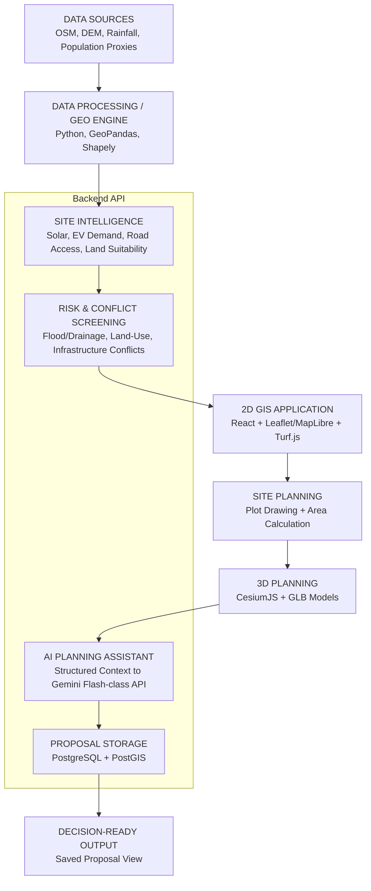
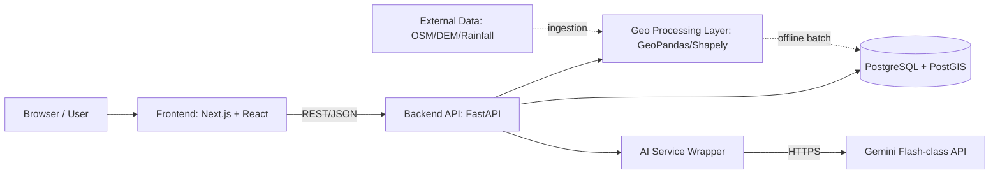
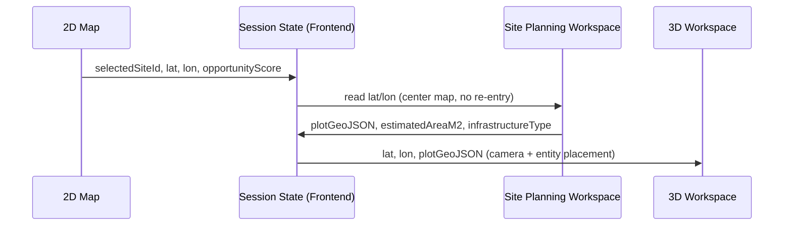
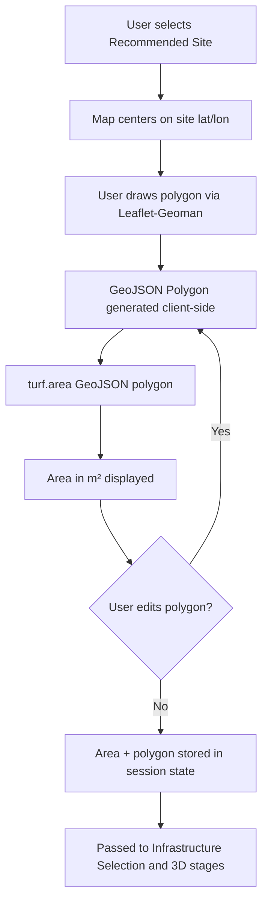

# URJASETU — TECHNICAL REQUIREMENTS DOCUMENT (TRD)

**Document Status:** DRAFT v1.0 — Implementation Blueprint
**Primary Source of Truth (Product):** UrjaSetu PRD
**Primary Source of Truth (Architecture/Context):** URJASETU_MASTER_BRIEF.md
**Supporting Context:** UrjaSetu_3D_AI_AddOn.md, Original UrjaSetu brief
**Project:** UrjaSetu
**Hackathon:** PCCOE International Grand Challenge 2026
**Primary Demo Town:** Kopargaon
**Primary Infrastructure:** Solar-EV Charging Hub

This document converts the approved PRD into a technically executable blueprint. It contains no application code, no Google Stitch prompts, no Antigravity prompts, and no Claude coding prompts — these are explicitly deferred to later documents.

---

## TABLE OF CONTENTS

1. Technical Overview
2. Technology Stack
3. System Architecture
4. Frontend Architecture
5. 2D GIS Implementation
6. Site Intelligence Engine
7. Opportunity Scoring Engine
8. Risk & Conflict Screening
9. Ranked Site Engine
10. Plot Drawing & Area Calculation
11. 3D Site Planning
12. 3D Model Interaction
13. AI Planning Assistant
14. Proposal Workspace
15. Database Design
16. API Design
17. Data Ingestion & Processing
18. Demo Data Strategy
19. Security
20. Performance
21. Error Handling & Fallbacks
22. Testing Strategy
23. Deployment Architecture
24. Project Directory Structure
25. Implementation Phases
26. Requirement Traceability
27. MVP Technical Boundary
28. Technical Risks
29. Final Implementation Checklist

Final Summary Sections: Architecture Summary, Technology Stack Summary, API Summary, Database Summary, Implementation Phase Summary, MVP Boundary, Technical Risks, PRD→TRD Traceability Summary.

---

## 1. TECHNICAL OVERVIEW

### 1.1 System Purpose
UrjaSetu is a web application that converts fragmented geospatial and climate data for an Indian town into a ranked, risk-screened, and explainable shortlist of Solar-EV Charging Hub sites, then carries a chosen site through plot measurement, conceptual 3D visualization, and AI-assisted explanation into a saved, decision-ready proposal.

### 1.2 Technical Goals
- **TRD-GOAL-01:** Deliver a working end-to-end FIND→SCREEN→MEASURE→VISUALIZE→EXPLAIN→DECIDE flow reliably, ahead of feature breadth.
- **TRD-GOAL-02:** Keep all geospatial scoring and risk logic deterministic and explainable — no opaque ML for the MVP.
- **TRD-GOAL-03:** Keep the AI layer strictly an explanation layer over structured, system-computed GIS facts — never a source of geographic truth.
- **TRD-GOAL-04:** Keep the system reusable across towns by parameterizing all town-specific data behind a common schema and API surface.
- **TRD-GOAL-05:** Ensure the demo can run even if external data/AI services are unavailable, via precomputed/local fallback data.

### 1.3 Architectural Philosophy
A single, modular monolith (not microservices) with clearly separated layers: a frontend map/planning/3D UI, a backend API that owns scoring/risk/proposal logic, a lightweight geospatial processing layer, a relational+spatial database, and an isolated AI service wrapper. Precompute what can be precomputed for a given town (site intelligence, risk, ranking) so runtime requests are simple reads plus a few live operations (polygon area calculation, AI review). This keeps the hackathon build small, testable, and reliable while still being technically real (not mocked).

### 1.4 Major Components
1. **Frontend Application** (React/Next.js + TypeScript) — 2D map, ranked sites, site planning workspace, 3D planner, AI review, proposal views.
2. **Backend API** (single REST service) — town/site/scoring/risk/plot/proposal/AI endpoints.
3. **Geo Processing Layer** — Python/GeoPandas/Shapely (offline/batch) for precomputing site intelligence and risk per town, plus Turf.js (browser) for live polygon area calculation.
4. **Database** — PostgreSQL + PostGIS for towns, candidate sites, analyses, plots, proposals.
5. **AI Service Wrapper** — a thin backend module that formats structured GIS metrics into a prompt, calls a Gemini Flash-class API, validates the response, and applies fallback logic on failure.

### 1.5 Data Flow (Narrative)
External/open datasets (OSM, DEM, rainfall, population proxies) are processed offline into per-town candidate site records with precomputed Site Intelligence metrics, Opportunity Scores, and Risk/Conflict statuses, which are loaded into PostgreSQL/PostGIS. The frontend requests ranked sites from the backend API and renders them on a 2D map. When a user selects and plans a site, the frontend performs live polygon drawing and area calculation (Turf.js), then sends the structured site+plot context to the backend, which either forwards it to the AI service for an explanation or falls back to a template. The completed context (site, plot, 3D placement, AI output) is persisted as a Proposal via the backend API.

### 1.6 User-to-System Interaction
The user never manually enters coordinates, IDs, or scores — all such values are carried automatically between UI states as described in the PRD (Section 12, Rule 7 of the Master Brief). All user-generated input is limited to: town selection, map/site clicks, polygon drawing, infrastructure choice, 3D model manipulation, and clicking stage-transition CTAs.

### 1.7 External Data Dependencies
- OpenStreetMap (roads, buildings, water features, POIs, land-use where available)
- Open DEM (elevation/slope for flood-risk proxy)
- Rainfall/climate datasets (public sources, for climate-risk proxy)
- Population/activity proxies (OSM POI density or public population datasets)
- Gemini Flash-class API (AI explanation)
- All of the above must have a precomputed/local fallback for demo reliability (see Section 18).

### 1.8 High-Level Architecture Diagram



---

## 2. TECHNOLOGY STACK

### 2.1 Frontend
| Technology | Why Selected |
|---|---|
| **React (Next.js)** | Component model fits the multi-screen PRD workflow; Next.js gives routing, SSR-optional pages, and fast local dev — well understood by hackathon teams. |
| **TypeScript** | Type safety for the many structured objects passed between stages (site, plot, proposal) reduces integration bugs under time pressure. |
| **Tailwind CSS** | Rapid, consistent styling matching the Master Brief's dark, high-contrast design language without hand-rolled CSS overhead. |
| **Leaflet** (recommended over MapLibre for MVP) | Mature, simple API, large ecosystem, works well with Leaflet-Geoman for drawing; MapLibre is a valid alternative if vector-tile styling becomes a priority, but Leaflet minimizes setup risk for a hackathon timeline. |
| **Leaflet-Geoman** | Actively maintained drawing/editing plugin for Leaflet; supports polygon draw + edit callbacks needed for live area recalculation. |
| **Turf.js** | Industry-standard browser-side geospatial calculation library; `turf.area()` gives the exact "estimated plot area" requirement with no backend round-trip. |
| **CesiumJS** | Only mainstream open web library providing full 3D geographic context (terrain + imagery + GLB placement) — directly specified by the Master Brief. |

### 2.2 Backend
| Technology | Why Selected |
|---|---|
| **Python + FastAPI** (recommended MVP choice) | Python's geospatial ecosystem (GeoPandas, Shapely) is the natural fit for the Site Intelligence and Risk engines; FastAPI gives fast REST development with automatic schema validation (Pydantic), which doubles as GeoJSON/request validation. |
| REST API (not GraphQL) | The PRD's data needs are simple, resource-oriented (sites, plots, proposals) — REST is simpler to implement and test in the available time. |

*Node.js/Express is a valid alternative if the team's strength is JavaScript end-to-end; this TRD recommends Python/FastAPI specifically because the Site Intelligence and Risk engines require GeoPandas/Shapely, which are Python-native and would otherwise require a second runtime or a Python microservice — adding unnecessary complexity. A single Python backend avoids that split.*

### 2.3 Database
| Technology | Why Selected |
|---|---|
| **PostgreSQL + PostGIS** | Native geometry types (Point, Polygon), spatial indexing (GiST), and spatial functions (ST_Area, ST_Intersects, ST_DWithin) map directly onto the product's needs (candidate site points, plot polygons, conflict intersection checks). SQLite has no comparable spatial extension suitable for this scope. |

### 2.4 AI
| Technology | Why Selected |
|---|---|
| **Gemini Flash-class API** (exact model selected at implementation time per current availability, per 3D+AI Add-On Section 24) | Low latency and cost suit a live-demo "Review with AI" interaction; the add-on document explicitly specifies this model family. The architecture is provider-agnostic at the wrapper boundary so the model can be swapped without touching the rest of the system. |

### 2.5 Geospatial Processing
| Technology | Why Selected |
|---|---|
| **GeoPandas** | Vectorized spatial operations over candidate site datasets (joins, buffers, distance calculations) for offline Site Intelligence/Risk precomputation. |
| **Shapely** | Underlying geometry operations (polygon validity checks, intersection tests) used both offline and, if needed, for backend-side validation of user-drawn polygons. |
| **Rasterio** (only if DEM raster processing is required) | Used only in the offline precomputation step to sample elevation/slope values for flood-risk proxies; not part of the live request path. |
| **GDAL** | Only as a transitive dependency of GeoPandas/Rasterio; no direct GDAL CLI usage is planned for the MVP — avoid introducing it as a standalone requirement. |

### 2.6 Data Sources
| Source | Role |
|---|---|
| OpenStreetMap (via Overpass API or pre-downloaded extracts) | Roads, buildings, water features, POIs, land-use where tagged |
| Open DEM (e.g., SRTM/Bhuvan DEM) | Elevation/slope for flood-risk proxy |
| Public rainfall/climate datasets | Climate-risk proxy input |
| OSM POI density | Population/activity proxy for EV Demand Proxy |
| Satellite/environmental context (optional, Bhuvan) | Supplementary land/surface context where time permits |

**Principle applied throughout Section 2:** one recommended stack per layer is selected to avoid unnecessary technology complexity; alternatives are noted only where a genuine tradeoff exists.

---

## 3. SYSTEM ARCHITECTURE

### 3.1 Component Communication Overview



### 3.2 Frontend Architecture
Single Next.js application. All map/3D rendering happens client-side; the frontend never computes Opportunity Score or Risk Status itself — it only renders values delivered by the backend, plus performs live polygon-area calculation with Turf.js (a pure geometric operation on user-drawn input, not a "fact" the product asserts independently).

### 3.3 Backend Architecture
Single FastAPI service exposing REST endpoints grouped by resource (towns, sites, plots, proposals, AI). Internally organized into modules: `scoring/` (Opportunity Scoring Engine), `risk/` (Risk & Conflict Screening), `geo/` (shared geometry helpers, polygon validation), `ai/` (AI Service Wrapper), `proposals/` (proposal assembly/persistence). No microservice split — a modular monolith is sufficient and reduces operational risk for a hackathon.

### 3.4 GIS Processing Architecture
Two distinct contexts:
- **Offline/batch (per town, run ahead of the demo):** GeoPandas/Shapely scripts ingest OSM/DEM/rainfall/population data, compute Solar Suitability, EV Demand Proxy, Road Accessibility, Land Suitability, Flood/Drainage Risk, and Conflict Status per candidate site, and write results into PostgreSQL/PostGIS.
- **Live/request-time:** (a) Turf.js in the browser computes polygon area on draw/edit; (b) the backend may optionally re-validate polygon geometry (closed, non-self-intersecting) using Shapely before persisting a proposal.

### 3.5 AI Service Architecture
A dedicated backend module (`ai/site_review.py`-equivalent) that: (1) accepts a structured metrics object from the proposal flow, (2) renders a fixed prompt template embedding only those metrics, (3) calls the Gemini Flash-class API over HTTPS with a timeout, (4) validates the response shape, and (5) on any failure, returns a deterministic template-based explanation built from the same metrics. The frontend never calls the AI API directly — this keeps the API key server-side only.

### 3.6 Database Architecture
PostgreSQL with the PostGIS extension enabled. Geometry columns use SRID 4326 (WGS84) for compatibility with Leaflet/CesiumJS coordinate expectations. GiST spatial indexes are created on all geometry columns used in spatial queries (candidate site points, plot polygons, conflict exclusion zones).

### 3.7 2D Map Architecture
Leaflet map instance owns: base tile layer, a GeoJSON layer per toggleable data layer (candidate sites, opportunity visualization, risk overlay, roads, buildings, land use), and a Leaflet-Geoman drawing layer scoped to the Site Planning Workspace screen only (not present on the dashboard).

### 3.8 3D Visualization Architecture
A CesiumJS `Viewer` instance is mounted only on the 3D Site Planner screen. It is initialized with the selected site's latitude/longitude (passed via shared frontend state, Section 4.4), uses Cesium's terrain/imagery providers for geographic context, and loads one GLB model as a Cesium `Entity`/`Model` at the site position, offset to sit within the drawn plot footprint (rendered as a `PolygonGraphics` entity from the same GeoJSON used in 2D).

### 3.9 Component Communication Summary
`Browser → Frontend (Next.js) → Backend API (FastAPI) → Geo Processing (GeoPandas/Shapely, mostly offline) → Database (PostgreSQL/PostGIS)`, with the `Backend API → AI Service Wrapper → Gemini API` branch invoked only for the AI review step. External GIS/data sources enter the system exclusively through the offline Data Ingestion & Processing pipeline (Section 17), never through a live call during the user-facing demo path, to protect reliability.

---

## 4. FRONTEND ARCHITECTURE

### 4.1 Pages / Routes
| Route | PRD Screen | Purpose |
|---|---|---|
| `/` | Screen 1 — Landing/Overview | Product intro, town selection entry |
| `/dashboard` | Screen 2 — Planning Dashboard | Map + layers + ranked candidate list |
| `/sites/[siteId]` | Screen 3 — Site Intelligence | Detailed metrics for one site |
| `/sites/[siteId]/risk` | Screen 4 — Risk & Conflict | Risk/conflict detail for one site |
| `/sites/[siteId]/plan` | Screen 5 — Site Planning Workspace | Plot drawing, area, infrastructure selection |
| `/sites/[siteId]/plan/3d` | Screen 6 — 3D Site Planner | CesiumJS scene, model placement |
| `/sites/[siteId]/plan/review` | Screen 7 — AI Proposal Review | AI assessment, verification checklist |
| `/proposals` | Screen 8 (list) — Saved Proposal | List of saved proposals |
| `/proposals/[proposalId]` | Screen 8 (detail) — Saved Proposal | Single saved proposal detail |

No additional major screens are introduced beyond the eight defined in the PRD.

### 4.2 Component Structure (indicative, non-code)
- `components/map/` — `BaseMap`, `LayerToggle`, `CandidateMarker`, `RiskOverlay`, `PlotDrawTool`
- `components/site/` — `SiteScoreCard`, `SiteMetricBreakdown`, `RiskConflictBadge`
- `components/planning/` — `AreaDisplay`, `InfrastructureSelector`
- `components/three-d/` — `CesiumSceneWrapper`, `ModelTransformControls`
- `components/ai/` — `AIAssessmentPanel`, `VerificationChecklist`
- `components/proposal/` — `ProposalSummaryCard`, `ProposalList`
- `components/shared/` — `DataSourceLabel` (renders "measured/derived/proxy/estimated/simulated" tag), `CTAButton`, `LoadingSkeleton`, `ErrorState`

### 4.3 State Management
A single lightweight global store (React Context + `useReducer`, or Zustand if the team prefers) holding the **active planning session**: `selectedTown`, `selectedSiteId`, `siteMetrics`, `plotGeoJSON`, `estimatedAreaM2`, `infrastructureType`, `modelPlacement`, `aiAssessment`. This session object is the mechanism that satisfies "no manual coordinate re-entry" — every screen reads from and writes to this one object as the user progresses.

### 4.4 API Client
A single typed API client module (e.g., `lib/api.ts`) wrapping `fetch`/`axios` with one function per backend endpoint (Section 16), returning typed responses matching the TypeScript interfaces shared with the backend's Pydantic models (kept in sync manually or via a shared OpenAPI-generated type file).

### 4.5 GIS Map Layer Management
Layers are modeled as a typed list of `{ id, label, type, defaultOn, dataSource }`. Toggling a layer adds/removes the corresponding Leaflet layer from the map instance without re-fetching already-loaded data.

### 4.6 Drawing Workflow (Frontend)
Leaflet-Geoman is enabled only within the Site Planning Workspace. On `pm:create` and `pm:edit` events, the resulting GeoJSON polygon is extracted, `turf.area()` is computed, and both are written into the session state described in 4.3.

### 4.7 Site-Selection State
Set once, on `View Site` / `Plan This Site` click, from the ranked-list API response; never re-derived from user text input.

### 4.8 Plot State
Owned by the Site Planning Workspace; persists into 3D and AI Review screens via the shared session object.

### 4.9 3D State
`modelPlacement = { position: {lat, lon, height}, rotationDeg, scale }`, updated live by the Cesium transform controls and read by the Proposal assembly step.

### 4.10 AI Proposal State
`aiAssessment = { label, reasoning: string[], verification: string[], source: "live" | "fallback" }`, set after the "Review with AI" call resolves (success or fallback).

---

## 5. 2D GIS IMPLEMENTATION

### 5.1 Base Map
Leaflet map with a standard OSM-derived tile base layer (self-hosted tile cache or public tile provider acceptable for a hackathon).

### 5.2 Layer Architecture
Each layer is an independent Leaflet `GeoJSON` or `LayerGroup`, toggled via the `LayerToggle` component:

| Layer | Default | Data Source | Notes |
|---|---|---|---|
| Candidate Sites | On | Backend `/api/sites/ranked` | Marker per site, colored/sized by Opportunity Score |
| Opportunity Score visualization | On | Same payload as above | Color scale (e.g., green→red) driven by score value, never color-only (also shown as a label per PRD-UX-006) |
| Solar Suitability | Off | Precomputed per-site attribute | Optional color overlay on markers when toggled |
| EV Demand Proxy | Off | Precomputed per-site attribute | Same pattern |
| Road Accessibility | Off | OSM road network (precomputed buffers) | Simplified line layer |
| Flood/Drainage Risk | Off | Precomputed risk polygons/markers | Distinct icon, not color-only |
| Conflict/Exclusion layers | Off | Precomputed conflict polygons | Distinct icon/pattern fill |
| Roads | Off | Raw OSM road geometries | Context only |
| Buildings | Off | OSM building footprints (P2) | Context only, may be omitted if time-constrained |
| Land Use | Off | OSM land-use tags where available (P2) | Context only |

### 5.3 Selected Location Marker
A distinct marker style (highlighted) is applied to the currently selected candidate on all map views, sourced from the session state (Section 4.3).

### 5.4 Polygon Drawing
Leaflet-Geoman toolbar (polygon tool only — other shapes disabled) enabled exclusively on the Site Planning Workspace route.

### 5.5 Map Interaction
Pan/zoom via native Leaflet controls; marker click opens Site Intelligence (`/sites/[siteId]`); layer toggles are checkbox controls in a fixed side panel.

### 5.6 Coordinate Flow: 2D Map → Site Planning → 3D

No coordinate is ever re-typed by the user; the same `lat`/`lon` values retrieved at selection time flow unchanged into the 3D `Viewer.camera.flyTo()`/entity placement call.

---

## 6. SITE INTELLIGENCE ENGINE

All four metrics are computed **offline/batch** per town and stored in the database; the frontend/backend only reads them at request time (no live recomputation in the user path).

### 6.1 Solar Suitability
- **Input data:** Available solar/environmental proxy data (e.g., open solar irradiance datasets where available, or a simplified proxy using elevation/aspect from DEM if irradiance data is unavailable for the town).
- **Preprocessing:** Clip to town extent; sample value at each candidate site location.
- **Calculation:** Direct value or simple aspect/slope-adjusted proxy.
- **Normalization:** Min-max scaled to 0–100 across the town's candidate set.
- **Output:** `solarSuitability: 0–100`.
- **Limitations:** Not an engineering-grade solar yield estimate; labeled **Proxy/Estimated**.

### 6.2 EV Demand Proxy
- **Input data:** OSM POI density, road activity indicators, optionally population density near the site.
- **Preprocessing:** Buffer each candidate site (e.g., 500m–1km radius); count/aggregate POIs and population proxy within the buffer.
- **Calculation:** Weighted count of activity signals within the buffer.
- **Normalization:** Min-max scaled to 0–100 across the town's candidate set.
- **Output:** `evDemandProxy: 0–100`.
- **Limitations:** Not exact EV demand forecasting; labeled **Proxy**.

### 6.3 Road Accessibility
- **Input data:** OSM road network.
- **Preprocessing:** Compute distance from each candidate site to the nearest classified road segment(s).
- **Calculation:** Inverse-distance or road-class-weighted score.
- **Normalization:** Min-max scaled to 0–100.
- **Output:** `roadAccessibility: 0–100`.
- **Limitations:** Reflects proximity/connectivity, not real traffic counts; labeled **Derived**.

### 6.4 Land Suitability
- **Input data:** OSM land-use tags where available; otherwise a simplified proxy (e.g., absence of known exclusion tags).
- **Preprocessing:** Tag-matching against an approved land-use category list.
- **Calculation:** Binary/graded suitability per matched category.
- **Normalization:** 0–100 scale.
- **Output:** `landSuitability: 0–100`.
- **Limitations:** Depends on OSM tagging completeness for the town; labeled **Derived/Proxy**.

### 6.5 Data Classification Summary
| Metric | Classification |
|---|---|
| Solar Suitability | Proxy / Estimated |
| EV Demand Proxy | Proxy |
| Road Accessibility | Derived |
| Land Suitability | Derived / Proxy |

Every metric returned by the API must include (or be accompanied by, in a fixed lookup table on the frontend) this classification for UI labeling (PRD-SI-001).

---

## 7. OPPORTUNITY SCORING ENGINE

### 7.1 Formula
```
Opportunity Score =
    Solar Suitability   × W1
  + EV Demand Proxy      × W2
  + Road Accessibility   × W3
  + Land Suitability     × W4
  - Risk Penalty         × W5
```

### 7.2 Score Range
0–100, clamped after weighting (values below 0 clamp to 0; above 100 clamp to 100).

### 7.3 Default Factor Weights (configurable)
| Factor | Default Weight |
|---|---|
| W1 Solar Suitability | 0.30 |
| W2 EV Demand Proxy | 0.25 |
| W3 Road Accessibility | 0.25 |
| W4 Land Suitability | 0.20 |
| W5 Risk Penalty | 1.00 (applied as a direct subtraction, not diluted) |

Weights are stored in a single configuration object (e.g., a `scoring_config` table or a versioned config file) — not hard-coded inline in multiple places — so they can be tuned without code changes elsewhere (PRD-OS-001).

### 7.4 Normalization
All four positive components are pre-normalized to 0–100 in the Site Intelligence Engine (Section 6) before this formula is applied, so the scoring engine performs a straightforward weighted sum, not its own normalization pass.

### 7.5 Missing-Data Handling
If a component is `null`/unavailable for a site, the engine excludes it from the weighted sum and re-normalizes the remaining weights proportionally, and the API response includes a `partialScore: true` flag with a `missingComponents: string[]` list (PRD-FR-004 error state).

### 7.6 Ranking
The Ranked Site Engine (Section 9) sorts strictly by descending `opportunityScore`; ties broken by lower Risk Penalty first, then by site ID for determinism.

### 7.7 Explainability
The API response for any site always includes the full component breakdown (`solarSuitability`, `evDemandProxy`, `roadAccessibility`, `landSuitability`, `riskPenalty`) alongside `opportunityScore`, matching the Master Brief's worked example (91/82/88/80/−8 → 84).

### 7.8 Determinism Requirement
Given identical stored component inputs and identical weight configuration, the computed `opportunityScore` for a site must be byte-identical across repeated calls — this is a direct testing requirement (Section 22).

---

## 8. RISK & CONFLICT SCREENING

### 8.1 Flood/Drainage Risk
- **Datasets:** Open DEM (elevation/slope), rainfall/climate proxy dataset, OSM water-body layer.
- **Spatial operations:** Compute distance from each candidate site to the nearest mapped water/drainage feature; sample elevation/slope at the site; combine into a composite risk index.
- **Buffering:** A fixed buffer radius (e.g., 100–200m) around water features defines "near-water" proximity risk.
- **Thresholds (example, configurable):**
  - LOW: distance > buffer AND slope above a safe threshold
  - MEDIUM: distance within buffer OR borderline slope
  - HIGH: distance very close to water/low-lying area AND low slope
- **Output:** `floodRisk: "Low" | "Medium" | "High"`.
- **Limitation disclosure:** Not an engineering-grade flood prediction — labeled a screening-level proxy.

### 8.2 Land-Use Conflicts
- **Datasets:** OSM land-use/landuse tags, protected-area tags where available.
- **Spatial operations:** Point-in-polygon (`ST_Intersects` / Shapely `.intersects()`) test between the candidate site (or a small buffer around it) and known exclusion polygons (water bodies, protected areas, incompatible land-use categories).
- **Output:** `conflictFlags: string[]` (e.g., `["water_body_overlap"]`), empty array if none detected.

### 8.3 Infrastructure Conflicts
- **Datasets:** OSM building footprints, major infrastructure tags, road geometries.
- **Spatial operations:** Distance/intersection checks between the candidate site (and, later, the drawn plot polygon) and existing structures/roads.
- **Output:** Additional entries appended to `conflictFlags`.

### 8.4 Exclusion Areas / Insufficient Usable Space
- At the candidate-site stage, "insufficient usable space" cannot be fully evaluated (no plot has been drawn yet); this is instead re-checked at proposal time by comparing `estimatedPlotAreaM2` against a configurable minimum threshold (e.g., 200 m²) for the selected infrastructure type, producing a `plotAdequate: boolean` flag surfaced in the AI/Proposal stages.

### 8.5 Candidate Status Derivation Logic
```
IF conflictFlags is non-empty AND includes a hard-exclusion flag (e.g., water_body_overlap):
    status = "Rejected"
ELSE IF floodRisk == "High":
    status = "Risk Flagged"
ELSE IF floodRisk == "Medium" OR conflictFlags is non-empty (soft flags only):
    status = "Review Required"
ELSE:
    status = "Recommended"
```
This logic is implemented once, server-side, and is the single source of truth for `candidateStatus` — it is never inferred independently by the frontend or by the AI (PRD-RC-005).

---

## 9. RANKED SITE ENGINE

### 9.1 Candidate Generation
Performed offline per town: a fixed set of candidate site locations (from a curated grid, POI-adjacent points, or manually curated planning-relevant points for the demo town) is generated and stored in the `CandidateSite` table.

### 9.2 Candidate Filtering
At request time, `/api/sites/ranked` may accept optional query filters (e.g., minimum opportunity score, exclude Rejected) but returns all sites by default so the UI can display the full risk-aware picture (including the deliberately Rejected/Risk Flagged demo site).

### 9.3 Scoring, Risk Screening, Ranking
Scores and risk/conflict statuses are precomputed and stored (not recalculated per request) for MVP simplicity and demo speed; a `POST /api/sites/recompute` admin-only endpoint may exist to regenerate them from the offline pipeline output (P1, not required for demo).

### 9.4 Top-N Results
The ranked list endpoint returns all candidate sites for the town (typically 4–8 for the demo dataset), pre-sorted; "Top-N" truncation, if needed for large towns, is a simple `LIMIT` applied after sorting.

### 9.5 Structured Candidate Response Shape
```json
{
  "site_id": "SITE-01",
  "latitude": 19.88,
  "longitude": 74.48,
  "opportunity_score": 84,
  "solar_score": 91,
  "ev_demand_proxy": 82,
  "road_accessibility": 88,
  "land_suitability": 80,
  "risk_penalty": 8,
  "flood_risk": "Low",
  "conflict_flags": [],
  "candidate_status": "Recommended",
  "estimated_plot_area": null,
  "reason_summary": "Strong solar suitability and road access with low screened flood risk."
}
```
`estimated_plot_area` is `null` at the ranked-list stage (no plot has been drawn yet) and is only populated after Section 10's plot-drawing flow completes for that site within a planning session.

---

## 10. PLOT DRAWING & AREA CALCULATION

### 10.1 Complete Technical Flow


### 10.2 Required Wording
The UI must display exactly: **"Estimated available plot area based on the drawn boundary."** This string constant is defined once (a shared i18n/constants module) and reused everywhere the area is shown, to prevent drift.

### 10.3 Forbidden Terms
The area value and any surrounding label/tooltip must never use: "cadastral," "legal," "survey-grade," or "authoritative," per PRD-PM-008 — enforced via a lint/checklist review of all UI copy referencing area, not a runtime check.

### 10.4 Backend Validation (on save)
When the plot is submitted to the backend (as part of proposal creation), the backend re-validates the GeoJSON polygon using Shapely: `is_valid`, `is_closed` (via `LinearRing` closure), and no self-intersection. Invalid polygons are rejected with a 400 error (Section 16.4).

### 10.5 Optional Unit Conversion
If implemented, `estimatedAreaAcres = estimatedAreaM2 / 4046.8564224`, computed once and displayed alongside m², only after verifying the conversion constant is correct (PRD-PM-007).

---

## 11. 3D SITE PLANNING

### 11.1 CesiumJS Setup
A single `Cesium.Viewer` instance mounted on the 3D Site Planner route, configured with:
- A terrain provider (Cesium World Terrain or a lightweight ellipsoid terrain if offline/token constraints require it for the demo).
- An imagery provider (Cesium Ion default imagery, or an OSM-based raster tile provider to avoid a paid token dependency if needed).
- Camera flown to the selected site's `latitude`/`longitude` via `viewer.camera.flyTo()` on mount, using the coordinates carried from the 2D selection (Section 5.6) — never re-entered.

### 11.2 Terrain / Buildings / Context
Terrain is enabled for realistic elevation context; 3D buildings (Cesium OSM Buildings) may be enabled where available as an optional context layer (P1) — not required for the MVP demo to function.

### 11.3 Geographic Coordinates
All entity placements use the same WGS84 (SRID 4326) lat/lon/height values as the rest of the system; height defaults to ground-clamped placement (`Cesium.HeightReference.CLAMP_TO_GROUND`) unless a specific height offset is needed for the model.

### 11.4 Model Loading (GLB Handling)
The Solar-EV Charging Hub `.glb` asset is loaded as a `Cesium.Model` (or `Entity` with a `model` graphics component) referencing a static asset URL served from the frontend's public assets directory (no dynamic model upload in MVP).

### 11.5 Entity/Model Placement
On first entering the 3D view for a session, the model is placed at the centroid of the drawn plot polygon (computed via Turf.js `turf.centroid()`), with the plot polygon itself rendered as a `PolygonGraphics` entity outline for visual reference.

### 11.6 Transformations
Position, rotation (heading), and scale are stored as a plain object (`{ lat, lon, height, headingDeg, scale }`) in frontend session state and applied to the Cesium entity via its `position`/`orientation`/`scale` properties on each user interaction (Section 12).

### 11.7 Framing
All UI copy and AI-facing descriptions of this module state "conceptual 3D planning" — never CAD, construction design, or engineering approval (PRD-3D-007).

---

## 12. 3D MODEL INTERACTION

### 12.1 Move
Implemented via a simple on-screen control (arrow buttons or drag-on-plane) that updates `position.lat/lon` in small increments or via a Cesium screen-space-to-cartographic drag handler; the updated position is written back to session state.

### 12.2 Rotate
A rotation slider/buttons update `headingDeg`, converted to a `Cesium.Transforms.headingPitchRollQuaternion` applied to the entity's `orientation`.

### 12.3 Scale / Resize
A scale slider updates the `scale` value applied to the `Cesium.Model`'s `scale` property (bounded to a sensible min/max, e.g., 0.5x–2x, to prevent unrealistic sizing).

### 12.4 Delete
Removes the entity from the Cesium viewer and clears `modelPlacement` from session state; the Infrastructure Selection step remains available to re-add a model.

### 12.5 Duplicate (Optional, P1)
If implemented, clones the current `modelPlacement` object with a small position offset and adds a second entity; not required for MVP.

### 12.6 State Storage
`modelPlacement` lives in the same frontend session object described in Section 4.3/4.9 and is included verbatim in the Proposal payload at save time (Section 14).

### 12.7 Asset Library Scope
Exactly one primary GLB model (Solar-EV Charging Hub) is required for MVP; a second optional model (e.g., a generic EV charging unit) may be added only if time permits (PRD-3D-008) — no asset marketplace or dynamic upload system is built.

---

## 13. AI PLANNING ASSISTANT

### 13.1 Architectural Principle
GIS provides the evidence; AI explains the evidence. The AI service wrapper never receives raw open datasets, only the already-computed structured metrics for the current site/plot.

### 13.2 Structured Context Sent to AI
```json
{
  "siteId": "SITE-01",
  "opportunityScore": 84,
  "solarSuitability": 91,
  "evDemandProxy": 82,
  "roadAccessibility": 88,
  "landSuitability": 80,
  "floodRisk": "Low",
  "conflictFlags": [],
  "candidateStatus": "Recommended",
  "estimatedPlotAreaM2": 2450,
  "selectedInfrastructure": "Solar EV Charging Hub"
}
```

### 13.3 Prompt Structure
A fixed system instruction plus the JSON context, structurally similar to:
- **System instruction (fixed, not user-editable):** "You are an explanation assistant for a municipal infrastructure planning tool. You must only reference the structured metrics provided below. Do not invent coordinates, land ownership, zoning, grid capacity, exact demand/generation figures, or claims of legal/engineering approval. Use advisory language. Always include a verification checklist."
- **User content:** the JSON object from 13.2, plus an explicit instruction to return the response in the fixed output schema (13.5).

### 13.4 Context Formatting
The wrapper serializes the metrics object as pretty-printed JSON embedded directly in the prompt; no additional free-text context is appended, minimizing the AI's opportunity to infer or hallucinate details not present in the data.

### 13.5 Response Format (expected from AI, validated on receipt)
```json
{
  "assessment": "Suitable for further planning",
  "reasoning": [
    "Strong solar suitability",
    "Good road accessibility",
    "High activity-based EV demand proxy"
  ],
  "verification": [
    "Grid capacity",
    "Land ownership",
    "Zoning",
    "Drainage",
    "Engineering feasibility"
  ]
}
```

### 13.6 Validation
On response receipt, the backend checks: (a) `assessment` is a non-empty string, (b) `reasoning` is a non-empty array of strings, (c) `verification` is a non-empty array of strings, (d) no field contains a numeric value not present in the input context (a lightweight heuristic check — e.g., reject/flag if the response contains a number not in the input JSON, as a hallucination guard). Responses failing validation trigger the fallback path (13.8).

### 13.7 Error Handling
API timeout (e.g., 8s), non-200 response, or malformed JSON all route to the same fallback logic; the failure is logged server-side but never surfaces a raw error to the end user.

### 13.8 Fallback Response (Deterministic Template)
If the AI call fails or fails validation, the backend generates a template response using simple conditional logic over the same structured metrics, e.g.:
```
assessment = candidateStatus == "Recommended" ? "Suitable for further planning" : "Review required before proceeding"
reasoning = [ if solarSuitability >= 80: "Strong solar suitability", if roadAccessibility >= 80: "Good road accessibility", if evDemandProxy >= 70: "Notable activity-based EV demand proxy", if floodRisk != "Low": "Elevated screened flood risk" ]
verification = ["Grid capacity", "Land ownership", "Zoning", "Drainage", "Engineering feasibility"]  // fixed default list
```
The response includes a `source: "fallback"` marker so the frontend can (optionally) note that this is a system-generated explanation rather than a live AI response — this is a transparency, not a demo-blocking, distinction.

### 13.9 AI Responsibilities (confirmed in scope)
Explain the recommendation; summarize strengths; identify risks already flagged by the system; highlight the verification checklist; optionally note qualitative planning considerations (traffic, accessibility, green-area impact) only if such data was actually supplied in the context — never invented.

### 13.10 Explicit AI Prohibitions
The AI must not claim: legal approval, land ownership status, exact energy generation, guaranteed EV demand, engineering approval, guaranteed flood safety, or guaranteed ROI (mirrors PRD-AI-007/008/010 verbatim).

---

## 14. PROPOSAL WORKSPACE

### 14.1 Flow
Ranked Site → Select Site → Draw Plot → Area → Select Solar-EV Hub → 3D Planning → AI Review → Save Proposal — implemented as the sequence of routes in Section 4.1, all reading/writing the single frontend session object.

### 14.2 Proposal Data Structure (persisted)
```json
{
  "proposal_id": "PROP-001",
  "site_id": "SITE-01",
  "town": "Kopargaon",
  "latitude": 19.88,
  "longitude": 74.48,
  "opportunity_score": 84,
  "component_scores": {
    "solar_suitability": 91,
    "ev_demand_proxy": 82,
    "road_accessibility": 88,
    "land_suitability": 80,
    "risk_penalty": 8
  },
  "flood_risk": "Low",
  "conflict_flags": [],
  "candidate_status": "Recommended",
  "plot_geojson": { "type": "Polygon", "coordinates": [[ /* ... */ ]] },
  "estimated_plot_area_m2": 2450,
  "infrastructure_type": "Solar EV Charging Hub",
  "model_placement": { "lat": 19.88, "lon": 74.48, "height": 0, "heading_deg": 0, "scale": 1.0 },
  "ai_assessment": {
    "assessment": "Suitable for further planning",
    "reasoning": ["..."],
    "verification": ["..."],
    "source": "live"
  },
  "status": "Draft",
  "created_at": "2026-09-11T10:00:00Z",
  "updated_at": "2026-09-11T10:00:00Z"
}
```

### 14.3 Proposal Status Values
`Draft`, `Saved` (matches the 3D+AI Add-On's MVP status scope; no approval workflow is built).

### 14.4 Site/Plot Consistency Enforcement
The backend proposal-creation endpoint accepts `site_id` and re-fetches the authoritative `opportunity_score`/`component_scores`/`flood_risk`/`conflict_flags` from the database at save time (rather than trusting client-submitted values for these fields), while accepting the client-submitted `plot_geojson`, `model_placement`, and `ai_assessment` as user/session-generated data — this guarantees PRD-PR-010 (same site/plot) without allowing score tampering.

---

## 15. DATABASE DESIGN

### 15.1 Technology
PostgreSQL 15+ with the PostGIS extension enabled (`CREATE EXTENSION postgis;`).

### 15.2 Entities (MVP-required only)

**Town**
| Field | Type | Notes |
|---|---|---|
| id | UUID / serial | PK |
| name | text | e.g., "Kopargaon" |
| center_lat | double precision | for default map view |
| center_lon | double precision | |
| bounds | geometry(Polygon, 4326) | town extent, spatial index |
| created_at | timestamptz | |

**CandidateSite**
| Field | Type | Notes |
|---|---|---|
| id | text (e.g. "SITE-01") | PK |
| town_id | UUID/serial | FK → Town.id |
| geom | geometry(Point, 4326) | GiST index |
| solar_suitability | numeric | 0–100 |
| ev_demand_proxy | numeric | 0–100 |
| road_accessibility | numeric | 0–100 |
| land_suitability | numeric | 0–100 |
| opportunity_score | numeric | 0–100, precomputed |
| risk_penalty | numeric | contributing penalty value |
| flood_risk | text | enum-like: Low/Medium/High |
| conflict_flags | text[] | array of flag codes |
| candidate_status | text | Recommended/Review Required/Risk Flagged/Rejected |
| reason_summary | text | short human-readable rationale |
| created_at | timestamptz | |

**SiteAnalysis** *(optional, if separating raw vs. derived data is preferred over flattening into CandidateSite; MVP may flatten into CandidateSite instead to reduce join complexity)*
| Field | Type | Notes |
|---|---|---|
| id | serial | PK |
| site_id | text | FK → CandidateSite.id |
| metric_name | text | e.g. "solar_suitability" |
| value | numeric | |
| data_classification | text | measured/derived/proxy/estimated/simulated |
| computed_at | timestamptz | |

**RiskAssessment** *(optional detail table; MVP may store the summary fields directly on CandidateSite as above and skip this table unless per-factor risk detail is needed for the UI)*
| Field | Type | Notes |
|---|---|---|
| id | serial | PK |
| site_id | text | FK → CandidateSite.id |
| flood_risk | text | |
| conflict_flags | text[] | |
| computed_at | timestamptz | |

**Plot**
| Field | Type | Notes |
|---|---|---|
| id | UUID/serial | PK |
| site_id | text | FK → CandidateSite.id |
| geom | geometry(Polygon, 4326) | GiST index |
| estimated_area_m2 | numeric | |
| created_at | timestamptz | |

**InfrastructureModel** *(static reference table, small)*
| Field | Type | Notes |
|---|---|---|
| id | text | e.g. "solar_ev_hub" |
| display_name | text | "Solar-EV Charging Hub" |
| glb_asset_url | text | path/URL to `.glb` |
| is_default | boolean | true for Solar-EV Charging Hub |

**Proposal**
| Field | Type | Notes |
|---|---|---|
| id | UUID/serial | PK |
| site_id | text | FK → CandidateSite.id |
| plot_id | UUID/serial | FK → Plot.id |
| infrastructure_id | text | FK → InfrastructureModel.id |
| model_placement | jsonb | `{lat, lon, height, heading_deg, scale}` |
| opportunity_score | numeric | snapshot at save time |
| component_scores | jsonb | snapshot |
| flood_risk | text | snapshot |
| conflict_flags | text[] | snapshot |
| ai_assessment | jsonb | `{assessment, reasoning[], verification[], source}` |
| status | text | Draft / Saved |
| created_at | timestamptz | |
| updated_at | timestamptz | |

**User** *(minimal, only if basic auth/attribution is required; the PRD does not mandate multi-user auth for MVP — this table may be deferred entirely if a single-session demo is acceptable)*
| Field | Type | Notes |
|---|---|---|
| id | UUID | PK |
| name | text | |
| role | text | e.g. "ULB Officer" |

### 15.3 Relationships
`Town 1—N CandidateSite`, `CandidateSite 1—N Plot`, `Plot 1—1 Proposal` (per saved proposal instance; a site could have multiple plots/proposals over time — `CandidateSite 1—N Proposal` via `Plot`), `InfrastructureModel 1—N Proposal`.

### 15.4 Geometry Types, SRID, Spatial Indexes
- All geometry columns use SRID 4326.
- `geometry(Point, 4326)` for `CandidateSite.geom`.
- `geometry(Polygon, 4326)` for `Town.bounds` and `Plot.geom`.
- GiST indexes: `CREATE INDEX ON candidate_site USING GIST (geom);` and equivalent for `plot.geom` and `town.bounds`.

### 15.5 Common Spatial Queries
- Sites within a town: `SELECT * FROM candidate_site WHERE ST_Within(geom, (SELECT bounds FROM town WHERE id = :town_id));`
- Conflict intersection check (offline pipeline): `SELECT * FROM candidate_site cs WHERE ST_Intersects(cs.geom, (SELECT geom FROM exclusion_zones WHERE ...));`
- Plot area cross-check (optional backend validation): `SELECT ST_Area(geom::geography) FROM plot WHERE id = :plot_id;` compared against the client-submitted Turf.js value as a sanity check (not the primary displayed value, which remains the client-side Turf.js result for immediate UI responsiveness).

---

## 16. API DESIGN

All endpoints are prefixed `/api`. Authentication: none required for MVP demo (single-tenant, no login flow specified in PRD); if a `User` concept is added later, a simple API key or session token can be layered on without changing this design.

### 16.1 Town APIs
**GET /api/towns**
- Purpose: List available towns.
- Request: none.
- Response: `[{ id, name, center_lat, center_lon }]`.
- Errors: 500 on DB failure.
- Auth: none.

**GET /api/towns/:townId**
- Purpose: Get town detail (for map centering).
- Response: `{ id, name, center_lat, center_lon, bounds }`.
- Errors: 404 if not found.

### 16.2 Site APIs
**GET /api/sites/ranked?townId=...**
- Purpose: Return all candidate sites for a town, sorted by Opportunity Score.
- Response: array of objects per Section 9.5.
- Errors: 400 if `townId` missing/invalid; 404 if town not found; 500 on DB failure.
- Auth: none.

**GET /api/sites/:siteId**
- Purpose: Full Site Intelligence detail for one site.
- Response: single object per Section 9.5, plus `data_classification` metadata per metric (Section 6.5).
- Errors: 404 if not found.

**GET /api/sites/:siteId/risk**
- Purpose: Risk & Conflict detail for one site (Screen 4).
- Response: `{ flood_risk, conflict_flags, candidate_status }`.
- Errors: 404 if not found.

**POST /api/sites/:siteId/analyze** *(admin/offline-trigger only, not part of the live user demo path)*
- Purpose: Recompute Site Intelligence metrics for a site from the offline pipeline output.
- Request: none or `{ force: true }`.
- Response: updated site object.
- Errors: 500 on pipeline failure.
- Auth: internal/admin only (not exposed to end users).

### 16.3 Scoring / Risk APIs
Scoring and risk are exposed as part of the Site APIs above (embedded fields) rather than as separate endpoints, since the PRD does not require standalone score/risk computation outside the context of a site — this avoids creating APIs with no clear product purpose.

### 16.4 Plot APIs
**POST /api/plots**
- Purpose: Persist a drawn plot (validated) prior to or as part of proposal creation.
- Request: `{ site_id, geometry: GeoJSON Polygon }`.
- Response: `{ plot_id, estimated_area_m2 }` (server recomputes area via PostGIS as a cross-check per 15.5, but the client-displayed value remains the Turf.js result).
- Errors: 400 if geometry invalid (not closed, self-intersecting); 404 if `site_id` not found.
- Auth: none.

### 16.5 3D / Infrastructure APIs
**GET /api/infrastructure-models**
- Purpose: List available infrastructure types and their GLB asset URLs.
- Response: `[{ id, display_name, glb_asset_url, is_default }]`.
- Errors: 500 on DB failure.

### 16.6 AI APIs
**POST /api/ai/site-review**
- Purpose: Generate an AI explanation for the current site+plot+infrastructure context.
- Request:
```json
{
  "siteMetrics": {
    "opportunityScore": 84,
    "solarSuitability": 91,
    "evDemandProxy": 82,
    "roadAccessibility": 88,
    "floodRisk": "Low",
    "conflictStatus": "Clear",
    "estimatedPlotAreaM2": 2450
  },
  "infrastructureType": "Solar EV Charging Hub"
}
```
- Response: `{ assessment, reasoning: string[], verification: string[], source: "live" | "fallback" }`.
- Errors: never returns a raw 5xx to the frontend for AI-provider failures — internally falls back per Section 13.8 and returns 200 with `source: "fallback"`; returns 400 only for malformed request bodies.
- Auth: none from the browser (the browser calls the backend, not the AI provider directly); the AI provider API key is used only server-side.

### 16.7 Proposal APIs
**POST /api/proposals**
- Purpose: Create and persist a proposal.
- Request: full payload per Section 14.2 (minus server-authoritative fields, which the server re-fetches per 14.4).
- Response: `{ proposal_id, created_at, status: "Saved" }`.
- Errors: 400 if required fields missing or plot/site mismatch detected; 404 if `site_id`/`plot_id` not found.
- Auth: none.

**GET /api/proposals**
- Purpose: List saved proposals (Screen 8 list).
- Response: array of proposal summaries.
- Errors: 500 on DB failure.

**GET /api/proposals/:proposalId**
- Purpose: Full proposal detail (Screen 8 detail).
- Response: full object per Section 14.2.
- Errors: 404 if not found.

Every endpoint above traces to a concrete PRD functional requirement (Section 26 traceability); no endpoint is added without such a mapping.

---

## 17. DATA INGESTION & PROCESSING

### 17.1 Pipeline Overview
```
Raw external data (OSM extract, DEM tile, rainfall dataset, POI data)
        ↓
Preprocessing (clip to town boundary, reproject to EPSG:4326, clean tags)
        ↓
Normalization (min-max scale each metric to 0–100 across the town's candidate set)
        ↓
Spatial processing (buffers, distance calculations, intersection tests — GeoPandas/Shapely)
        ↓
Derived metrics (Solar Suitability, EV Demand Proxy, Road Accessibility, Land Suitability, Flood Risk, Conflict Flags, Opportunity Score, Candidate Status)
        ↓
Database (bulk insert/update into CandidateSite table via a Python script using SQLAlchemy/psycopg2 + GeoAlchemy2)
```

### 17.2 Per-Source Handling
- **OSM:** Download a town-scoped extract (via Overpass API query or a pre-clipped `.osm.pbf`/GeoJSON export) once, offline; parse with GeoPandas.
- **DEM:** Download a town-scoped raster tile once, offline; sample point values with Rasterio at each candidate location.
- **Rainfall/climate:** Use a static, town-scoped value or small lookup table if a full time-series dataset is unnecessary for the MVP's screening-level need.
- **Population/activity proxy:** Derived from OSM POI density within a buffer (Section 6.2) — no separate population dataset is strictly required for MVP if POI density is a sufficient proxy.

### 17.3 What Can Be Precomputed for the Hackathon Demo
Everything in Section 17.1 for the primary demo town (Kopargaon) is run once, ahead of time, and the results are loaded into the database as a fixed dataset. No live external API call occurs during the actual demo session — this is a deliberate reliability decision (Master Brief Rule 10, PRD-NFR-009).

### 17.4 Reusability for Other Towns
The same pipeline script accepts a town boundary + town name as parameters and produces the same schema of output, so adding a new town is a matter of running the offline pipeline again with new inputs — no code changes to the frontend, backend API, or database schema are required (TRD-GOAL-04).

---

## 18. DEMO DATA STRATEGY

### 18.1 Kopargaon Demo Dataset (minimum, per PRD Section 20)
A fixed JSON/SQL seed file containing 4–6 candidate sites with deliberately varied values, for example:

| Site | Opportunity Score | Solar | EV Proxy | Road Access | Flood Risk | Conflict | Status |
|---|---|---|---|---|---|---|---|
| SITE-01 | 84 | 91 | 82 | 88 | Low | none | Recommended |
| SITE-02 | 76 | 85 | 70 | 75 | Low | none | Recommended |
| SITE-03 | 68 | 72 | 65 | 80 | Medium | none | Review Required |
| SITE-04 | 79 | 88 | 74 | 82 | High | none | Risk Flagged |
| SITE-05 | 71 | 80 | 68 | 60 | Low | water_body_overlap | Rejected |
| SITE-06 | 60 | 65 | 55 | 70 | Low | none | Review Required |

### 18.2 Sample GeoJSON Plot (for SITE-01)
```json
{
  "type": "Polygon",
  "coordinates": [[
    [74.4800, 19.8800],
    [74.4805, 19.8800],
    [74.4805, 19.8804],
    [74.4800, 19.8804],
    [74.4800, 19.8800]
  ]]
}
```
Yielding an estimated area near the demo's target figure of ~2,450 m² (exact coordinates to be tuned so `turf.area()` produces a value close to this reference number).

### 18.3 Sample 3D Placement
```json
{ "lat": 19.8802, "lon": 74.4802, "height": 0, "heading_deg": 0, "scale": 1.0 }
```

### 18.4 Sample AI Context (matches Section 13.2)
Used directly as the seeded example for demo rehearsal and for the automated AI-context test (Section 22).

### 18.5 Labeling
The seed data loader inserts a `data_classification: "simulated_demo"` tag alongside any metric that is not backed by a real processed dataset for Kopargaon at build time, ensuring the UI's data-source labeling (Section 6.5) remains accurate even for demo-augmented values (Master Brief Data Honesty Rule).

---

## 19. SECURITY

- **TRD-SEC-001:** The Gemini API key is stored only as a backend environment variable (`.env`, never committed to source control) and is never sent to or accessible from the frontend bundle.
- **TRD-SEC-002:** All backend endpoints validate request bodies against a Pydantic schema; malformed requests return 400 before touching business logic.
- **TRD-SEC-003:** GeoJSON polygons are validated for structural correctness (valid geometry type, closed ring, coordinate bounds within the town's plausible extent) before persistence, preventing malformed/malicious geometry from reaching PostGIS.
- **TRD-SEC-004:** The AI prompt template (Section 13.3) embeds only the fixed structured JSON context — no raw user free-text is ever concatenated into the prompt, closing the main prompt-injection vector for this feature.
- **TRD-SEC-005:** Basic rate limiting (e.g., a simple in-memory or reverse-proxy limiter) is applied to `/api/ai/site-review` to avoid runaway API cost during testing/demo.
- **TRD-SEC-006:** Database credentials are environment variables; the database is not exposed on a public port outside the deployment network.
- **TRD-SEC-007:** CORS is configured on the backend to allow only the deployed frontend origin (plus `localhost` during development).
- **TRD-SEC-008:** Secrets management uses a `.env` file locally and the hosting platform's secret/environment variable store in deployment (Section 23) — no secrets in the repository.

Enterprise-grade security (full auth/RBAC, WAF, audit logging) is explicitly out of scope for the hackathon MVP, consistent with PRD Non-Goals.

---

## 20. PERFORMANCE

| Operation | Target | Approach |
|---|---|---|
| Map initial load (dashboard) | < 3s on a standard connection | Precomputed, small (4–8 site) demo dataset; avoid large GeoJSON payloads |
| Ranked sites API response | < 500ms | Single indexed query against precomputed `CandidateSite` table, no live spatial recomputation |
| Plot area calculation | Instant (client-side) | Turf.js runs entirely in-browser; no network round-trip needed for display |
| AI response | < 5–8s with visible loading state; fallback triggers beyond timeout | Timeout-bounded API call plus deterministic fallback (Section 13.7/13.8) |
| 3D model loading | < 3s for the demo scene | Keep the GLB model file size small (target well under 5MB); limit polygon/plot complexity rendered in Cesium |

**Avoiding unnecessary cost:**
- No live spatial recalculation on every map pan/zoom — layers are loaded once per town selection.
- GeoJSON payloads are limited to the demo town's small candidate set; no nationwide dataset is ever loaded into the browser.
- 3D assets are limited to 1–2 lightweight, pre-optimized GLB files (no procedural or high-poly assets).
- The frontend caches the ranked-sites response for the duration of a planning session rather than refetching on every screen transition.

---

## 21. ERROR HANDLING & FALLBACKS

| Failure | Fallback Behavior |
|---|---|
| OSM data unavailable (offline pipeline) | Use last successfully processed extract or the static demo seed dataset (Section 18) |
| External data source unavailable (DEM/rainfall) | Fall back to previously computed/cached metric values; never block the pipeline entirely on one source |
| AI API unavailable/timeout | Deterministic template-based explanation (Section 13.8), returned as a normal 200 response with `source: "fallback"` |
| 3D model (GLB) fails to load | Render a placeholder marker/footprint in the Cesium scene with a UI note "3D model unavailable — conceptual placement only"; user can still proceed to AI Review and Save Proposal |
| Database failure | Backend returns 503 with a generic "service temporarily unavailable" message; frontend shows a retry option; for the live demo, a pre-verified local DB instance minimizes this risk |
| Invalid polygon (self-intersecting / not closed) | Reject at both client (Leaflet-Geoman validation) and server (Shapely validation) layers with a clear "Please draw a valid closed boundary" message; no partial save occurs |
| Missing geospatial data for a specific metric | Metric displayed as "Not available"; Opportunity Score computed as a partial score with `missingComponents` flagged (Section 7.5), never silently defaulted to a fabricated number |

The guiding rule (Section 26 of the PRD): every fallback preserves the ability to demo the full FIND→DECIDE story, using clearly labeled static/demo data where live data is unavailable.

---

## 22. TESTING STRATEGY

### 22.1 Unit Tests
- Opportunity Scoring Engine: given fixed component inputs and weights, output score matches expected value exactly (determinism).
- Risk classification logic: given fixed flood risk/conflict inputs, `candidate_status` output matches the decision table in Section 8.5.
- Polygon validation function: valid/invalid GeoJSON inputs produce correct accept/reject results.
- AI response validator: accepts well-formed responses, rejects malformed ones and triggers fallback.

### 22.2 Integration Tests
- `GET /api/sites/ranked` returns a correctly sorted list for the seeded Kopargaon dataset.
- `POST /api/plots` persists a valid polygon and rejects an invalid one.
- `POST /api/proposals` correctly assembles a proposal from a site + plot + AI response combination and re-fetches authoritative score/risk fields rather than trusting client input for those fields.

### 22.3 API Tests
- Each endpoint in Section 16 tested for: success case, missing-field 400, not-found 404, and (where applicable) fallback-path 200.

### 22.4 GIS Calculation Tests
- `turf.area()` output for a known reference polygon matches an independently computed expected value within acceptable tolerance.
- Buffer/intersection logic (offline pipeline) produces expected conflict flags for known synthetic test geometries.

### 22.5 Scoring Tests
- Same input twice → same score (determinism, PRD acceptance criterion).
- Missing one component → partial score computed with correct proportional re-weighting and `missingComponents` populated.

### 22.6 Risk Tests
- A synthetic site placed inside a known water-body test polygon is correctly flagged `Rejected`.
- A synthetic high-flood-risk site with an otherwise high opportunity score is correctly flagged `Risk Flagged`, not `Recommended` (validates PRD-RC-005 directly).

### 22.7 Polygon / Area Tests
- Drawing → editing a polygon triggers a recalculated area value matching the new geometry.
- Self-intersecting polygon is rejected client-side and server-side.

### 22.8 3D Workflow Tests
- Given a site's lat/lon, the Cesium camera target matches that lat/lon (no drift/re-entry error).
- Model placement transform object updates correctly on move/rotate/scale/delete actions.

### 22.9 AI Context Tests
- The exact JSON object sent to the AI service contains only the approved fields (Section 13.2) — no extraneous or raw-dataset fields are included (validated via a request-payload snapshot test).
- A forced AI-service failure (mocked) results in a valid fallback response, and the calling proposal-creation flow completes successfully despite the AI failure (validates PRD-AI-006 / AC-09 directly).

### 22.10 End-to-End Tests
- Full FIND→DECIDE flow for the seeded Kopargaon dataset: select town → view ranked sites → open a Recommended site → plan it → draw a plot → confirm area → select infrastructure → open 3D → move the model → review with AI → save proposal → verify the saved proposal matches all session data (this is the single most important test in the suite, directly validating the PRD's top-level acceptance criterion).
- A second end-to-end run selecting the deliberately Risk Flagged/Rejected site, confirming the UI correctly discourages proceeding to "Recommended" framing for that site.

---

## 23. DEPLOYMENT ARCHITECTURE

### 23.1 Frontend Hosting
Vercel (native fit for Next.js) or Netlify — static/SSR build deployed directly from the repository; environment variables (backend API base URL) configured in the hosting platform's dashboard.

### 23.2 Backend Hosting
A single containerized FastAPI service deployed to a simple PaaS (e.g., Render, Railway, or Fly.io) — chosen for minimal DevOps overhead versus a full Kubernetes/cloud-VM setup, which would be unnecessary complexity for a hackathon timeline.

### 23.3 Database Hosting
A managed PostgreSQL instance with PostGIS enabled (e.g., Render Postgres, Railway Postgres, or Supabase) — avoids self-managing backups/patching during the hackathon window.

### 23.4 AI API
Called server-side only, over HTTPS, using the Gemini Flash-class API endpoint; API key supplied via the backend host's environment variable store.

### 23.5 Environment Variables (indicative)
- Frontend: `NEXT_PUBLIC_API_BASE_URL`
- Backend: `DATABASE_URL`, `GEMINI_API_KEY`, `AI_REQUEST_TIMEOUT_SECONDS`, `ALLOWED_ORIGINS`

### 23.6 CORS
Backend `ALLOWED_ORIGINS` restricted to the deployed frontend domain and `http://localhost:3000` for development.

### 23.7 Production Build
Standard `next build` for the frontend and a standard Uvicorn/Gunicorn ASGI server process for the FastAPI backend; no custom build tooling is introduced.

Deployment is intentionally simple: three managed services (frontend, backend, database) plus one external API call (AI) — no additional infrastructure.

---

## 24. PROJECT DIRECTORY STRUCTURE

```
urjasetu/
├── frontend/
│   ├── app/                 # Next.js routes per Section 4.1
│   ├── components/          # map/, site/, planning/, three-d/, ai/, proposal/, shared/
│   ├── lib/                 # api.ts (API client), constants.ts (required wording strings)
│   ├── state/                # session store (Section 4.3)
│   └── public/assets/models/ # .glb infrastructure models
├── backend/
│   ├── app/
│   │   ├── api/              # routers: towns, sites, plots, proposals, ai
│   │   ├── scoring/           # Opportunity Scoring Engine
│   │   ├── risk/              # Risk & Conflict Screening logic
│   │   ├── geo/               # shared geometry helpers, polygon validation
│   │   ├── ai/                # AI Service Wrapper + fallback templates
│   │   ├── models/            # SQLAlchemy/GeoAlchemy2 ORM models
│   │   └── main.py            # FastAPI app entrypoint
│   └── tests/                 # unit/integration/API tests (Section 22)
├── geo-engine/
│   ├── pipeline/               # offline ingestion + Site Intelligence + Risk precomputation scripts
│   └── notebooks/              # exploratory analysis (optional, not shipped)
├── data/
│   ├── raw/                    # downloaded OSM/DEM/rainfall extracts (town-scoped)
│   ├── processed/               # intermediate precomputed outputs
│   └── seed/                    # demo dataset seed files (Section 18)
├── scripts/
│   └── seed_db.py               # loads data/seed into PostgreSQL
├── docs/
│   ├── URJASETU_MASTER_BRIEF.md
│   ├── UrjaSetu_PRD.md
│   └── URJASETU_TECHNICAL_REQUIREMENTS_DOCUMENT.md
└── README.md
```

This structure keeps the geospatial precomputation (`geo-engine/`) cleanly separated from the live backend (`backend/`), reflecting the offline/live split described in Section 3.4, and remains practical for a small student hackathon team to navigate.

---

## 25. IMPLEMENTATION PHASES

### PHASE 1 — Project Setup + Architecture
- **Components:** Repo scaffolding per Section 24; FastAPI skeleton; Next.js skeleton; PostgreSQL+PostGIS provisioned.
- **APIs:** None functional yet (health-check endpoint only).
- **Database work:** Create schema/migrations for all Section 15 tables.
- **Frontend work:** Base layout, routing skeleton for all 9 routes.
- **Backend work:** App structure, DB connection, environment config.
- **Dependencies:** None (first phase).
- **Completion criteria:** Frontend and backend run locally and can reach the database; empty pages render without error.

### PHASE 2 — 2D Map + Town Data
- **Components:** `BaseMap`, town selection.
- **APIs:** `GET /api/towns`, `GET /api/towns/:townId`.
- **Database work:** Seed `Town` table for Kopargaon.
- **Frontend work:** Landing page, Dashboard shell with map centered on Kopargaon.
- **Backend work:** Town endpoints.
- **Dependencies:** Phase 1.
- **Completion criteria:** Selecting Kopargaon centers the map correctly (AC-01 precondition).

### PHASE 3 — Site Intelligence + Scoring
- **Components:** Offline pipeline (Section 17), Opportunity Scoring Engine (Section 7).
- **APIs:** `GET /api/sites/:siteId`.
- **Database work:** Seed `CandidateSite` with precomputed metrics for Kopargaon demo sites.
- **Frontend work:** Site Intelligence screen with metric breakdown and data-source labels.
- **Backend work:** Scoring module, data-classification metadata.
- **Dependencies:** Phase 2.
- **Completion criteria:** AC-03 passes for at least one site.

### PHASE 4 — Risk / Conflict Screening
- **Components:** Risk classification logic (Section 8.5).
- **APIs:** `GET /api/sites/:siteId/risk`.
- **Database work:** Populate `flood_risk`, `conflict_flags`, `candidate_status` per demo site.
- **Frontend work:** Risk & Conflict screen.
- **Backend work:** Risk module.
- **Dependencies:** Phase 3.
- **Completion criteria:** AC-02 passes (at least one Recommended, one Risk Flagged/Rejected site).

### PHASE 5 — Ranked Sites
- **Components:** Ranked Site Engine (Section 9).
- **APIs:** `GET /api/sites/ranked`.
- **Database work:** Indexing/sorting verification.
- **Frontend work:** Planning Dashboard candidate list + layer toggles.
- **Backend work:** Ranking query.
- **Dependencies:** Phases 3–4.
- **Completion criteria:** Ranked list renders sorted by score with risk badges (AC-01, AC-02 fully satisfied).

### PHASE 6 — Plot Drawing + Area Calculation
- **Components:** Leaflet-Geoman integration, Turf.js area calculation (Section 10).
- **APIs:** `POST /api/plots`.
- **Database work:** `Plot` table writes.
- **Frontend work:** Site Planning Workspace, area display with required wording.
- **Backend work:** Polygon validation (Shapely).
- **Dependencies:** Phase 5.
- **Completion criteria:** AC-04, AC-05 pass.

### PHASE 7 — 3D Planning
- **Components:** CesiumJS scene, GLB model, transform controls (Sections 11–12).
- **APIs:** `GET /api/infrastructure-models`.
- **Database work:** Seed `InfrastructureModel` table.
- **Frontend work:** 3D Site Planner screen, infrastructure selection UI.
- **Backend work:** None beyond the models endpoint.
- **Dependencies:** Phase 6.
- **Completion criteria:** AC-06, AC-07 pass.

### PHASE 8 — AI Proposal Assistant
- **Components:** AI Service Wrapper (Section 13), fallback templates.
- **APIs:** `POST /api/ai/site-review`.
- **Database work:** None (stateless call).
- **Frontend work:** AI Proposal Review screen.
- **Backend work:** Prompt construction, response validation, fallback logic.
- **Dependencies:** Phase 7 (needs full context object).
- **Completion criteria:** AC-08, AC-09 pass.

### PHASE 9 — Proposal Saving
- **Components:** Proposal assembly and persistence (Section 14).
- **APIs:** `POST /api/proposals`, `GET /api/proposals`, `GET /api/proposals/:proposalId`.
- **Database work:** `Proposal` table writes/reads.
- **Frontend work:** Save action, Saved Proposal list/detail screens.
- **Backend work:** Server-side re-fetch of authoritative fields (Section 14.4).
- **Dependencies:** Phase 8.
- **Completion criteria:** AC-10 passes.

### PHASE 10 — Testing + Demo Hardening
- **Components:** Full test suite (Section 22), fallback verification (Section 21), demo dataset finalization (Section 18).
- **APIs:** No new endpoints; regression testing of all existing ones.
- **Database work:** Final seed data review/tuning (e.g., adjusting the reference polygon to hit ~2,450 m²).
- **Frontend work:** Empty/error/loading states audit across all 9 screens (AC-11).
- **Backend work:** Timeout/fallback rehearsal for AI and 3D failure paths.
- **Dependencies:** Phases 1–9 complete.
- **Completion criteria:** Full end-to-end demo run (Section 22.10) passes twice consecutively without manual intervention.

---

## 26. REQUIREMENT TRACEABILITY

| PRD Requirement | TRD Component | API | Database | Frontend | Test |
|---|---|---|---|---|---|
| PRD-FR-001 (Town Selection) | Section 3.3, 17.4 | GET /api/towns, GET /api/towns/:id | Town | Landing, Dashboard | Integration: town list/select |
| PRD-FR-002 (2D Map) | Section 5 | GET /api/sites/ranked | CandidateSite | Dashboard map | E2E: map render |
| PRD-FR-003 (Site Intelligence) | Section 6 | GET /api/sites/:siteId | CandidateSite | Site Intelligence screen | Unit: metric labeling |
| PRD-FR-004 (Opportunity Scoring) | Section 7 | GET /api/sites/:siteId | CandidateSite | Site Intelligence screen | Unit: determinism, partial score |
| PRD-FR-005 (Ranked Sites) | Section 9 | GET /api/sites/ranked | CandidateSite | Dashboard list | Integration: sort order |
| PRD-FR-006 (Risk & Conflict) | Section 8 | GET /api/sites/:siteId/risk | CandidateSite | Risk & Conflict screen | Unit: status decision table |
| PRD-FR-007 (Site Selection) | Section 4.7, 5.6 | GET /api/sites/:siteId | — (frontend state) | All planning screens | E2E: coordinate continuity |
| PRD-FR-008/009 (Plot Drawing/Area) | Section 10 | POST /api/plots | Plot | Site Planning Workspace | Unit/GIS: area calc, validation |
| PRD-FR-010 (Infrastructure Selection) | Section 12.7 | GET /api/infrastructure-models | InfrastructureModel | Site Planning Workspace | Integration: model list |
| PRD-FR-011/012 (3D Planning/Model Placement) | Sections 11–12 | GET /api/infrastructure-models | InfrastructureModel | 3D Site Planner | 3D workflow tests |
| PRD-FR-013/014 (AI Assistant/Review) | Section 13 | POST /api/ai/site-review | — (stateless) | AI Proposal Review | AI context + fallback tests |
| PRD-FR-015/016 (Proposal Creation/Saving) | Section 14 | POST /api/proposals | Proposal | AI Review → Save action | Integration: proposal assembly |
| PRD-FR-017 (Saved Proposal Viewing) | Section 14 | GET /api/proposals, GET /api/proposals/:id | Proposal | Saved Proposal list/detail | Integration: retrieval matches save |
| PRD-RC-005 (Risk overrides opportunity) | Section 8.5 | GET /api/sites/:siteId/risk | CandidateSite | Risk & Conflict screen | Unit: high-score + high-risk case |
| PRD-PM-008 (Terminology constraint) | Section 10.2–10.3 | POST /api/plots | Plot | Area display component | Manual/lint: copy audit |
| PRD-AI-006/007/008 (AI guardrails/fallback) | Section 13.6–13.10 | POST /api/ai/site-review | — | AI Proposal Review | AI context + forced-failure test |
| PRD-PR-010 (Site/plot consistency) | Section 14.4 | POST /api/proposals | Proposal, Plot, CandidateSite | AI Review → Save | Integration: consistency check |
| Top-Level Acceptance Criterion (Section 24 of PRD) | Sections 4–14 (full flow) | All above | All above | All 9 screens | E2E full flow (Section 22.10) |

This table is illustrative of the mapping methodology; the development team should extend it row-by-row for any additional PRD requirement IDs not explicitly listed above, using the same ID scheme (`TRD-ARCH-###`, `TRD-API-###`, `TRD-DB-###`, `TEST-###` as needed for finer-grained tracking during implementation).

---

## 27. MVP TECHNICAL BOUNDARY

### MUST IMPLEMENT
- Next.js/React frontend with all 9 routes (Section 4.1)
- FastAPI backend with all endpoints in Section 16 except the admin-only recompute endpoint
- PostgreSQL + PostGIS with the schema in Section 15 (User table may be omitted if no auth is needed)
- Offline geo-processing pipeline producing the Kopargaon demo dataset
- Opportunity Scoring Engine (deterministic, Section 7)
- Risk & Conflict Screening logic (Section 8)
- Leaflet + Leaflet-Geoman 2D map and plot drawing
- Turf.js area calculation
- CesiumJS 3D scene with one GLB model and move/rotate/scale/delete
- AI Service Wrapper with live Gemini call and deterministic fallback
- Proposal creation, persistence, and viewing

### SHOULD IMPLEMENT
- Road/building/land-use optional map layers (P1/P2 per PRD Section 22)
- Backend polygon re-validation via Shapely (Section 10.4) — strongly recommended, not strictly demo-blocking if time is short
- Basic rate limiting on the AI endpoint

### NICE TO HAVE
- Duplicate 3D model action
- Acres unit conversion
- Additional infrastructure model options
- Proposal PDF/export
- Multiple towns beyond Kopargaon
- Admin recompute endpoint for live re-scoring

### OUT OF SCOPE
- Full digital twin, CAD tooling, survey-grade measurement, cadastral verification
- Exact EV demand/solar generation forecasting
- Grid capacity certification, legal/zoning approval automation
- Multi-user auth/RBAC, enterprise security hardening
- Microservice decomposition, Kubernetes, or any infrastructure beyond Section 23's simple three-service deployment
- Large 3D asset marketplace or dynamic model upload

This boundary matches PRD Section 22 exactly; no technical scope expansion beyond the PRD's Must Have / Nice to Have / Out of Scope lists is introduced.

---

## 28. TECHNICAL RISKS

| Risk | Probability | Impact | Mitigation | Fallback |
|---|---|---|---|---|
| External GIS data (OSM/DEM/rainfall) incomplete or slow for Kopargaon | Medium | Medium | Run offline pipeline well ahead of demo; validate output manually | Use hand-curated/adjusted demo dataset (Section 18) |
| AI API (Gemini) latency, quota, or outage during live demo | Medium | High | Timeout + deterministic fallback (Section 13.8) built and tested in advance | Fallback template response; note "system-generated explanation" if needed |
| 3D performance on demo hardware/browser | Medium | Medium | Keep GLB file size small; limit terrain/imagery detail; rehearse on actual demo machine | Static 3D preview image or reduced-fidelity scene as a last-resort fallback |
| Geospatial processing bugs (invalid geometry, CRS mismatches) | Medium | Medium | Enforce SRID 4326 everywhere; unit test geometry helpers (Section 22.4) | Manual data correction in the seed dataset before demo |
| Database connectivity/hosting issues on demo day | Low | High | Use a stable managed Postgres instance; keep a local fallback DB copy ready | Run the full stack locally as a backup if hosted deployment fails |
| Deployment/environment misconfiguration (CORS, env vars) | Medium | Medium | Finalize and freeze environment configuration before Phase 10; test the deployed build, not just local | Revert to local demo environment |
| Demo reliability regression from late feature additions | Medium | High | Freeze scope after Phase 9; Phase 10 is testing/hardening only, no new features | Roll back to last known-good build for the live demo |

---

## 29. FINAL IMPLEMENTATION CHECKLIST

- [x] Frontend architecture defined (Section 4)
- [x] Backend architecture defined (Section 3.3)
- [x] GIS architecture defined (Sections 3.4, 5)
- [x] Scoring defined (Section 7)
- [x] Risk engine defined (Section 8)
- [x] Ranked sites defined (Section 9)
- [x] Plot drawing defined (Section 10)
- [x] Area calculation defined (Section 10)
- [x] 3D architecture defined (Sections 11–12)
- [x] AI architecture defined (Section 13)
- [x] Proposal architecture defined (Section 14)
- [x] Database defined (Section 15)
- [x] APIs defined (Section 16)
- [x] Data strategy defined (Section 17)
- [x] Demo strategy defined (Section 18)
- [x] Testing defined (Section 22)
- [x] Deployment defined (Section 23)
- [x] Fallback defined (Section 21)
- [x] Traceability completed (Section 26)

---

## FINAL SUMMARY SECTIONS

### 1. Architecture Summary
UrjaSetu is a modular monolith: a Next.js/React frontend (map, planning, 3D, AI review, proposals) talking over REST to a single FastAPI backend that owns scoring, risk, AI-wrapper, and proposal logic, backed by PostgreSQL+PostGIS. Geospatial facts are precomputed offline (GeoPandas/Shapely) per town and served as simple reads; the only genuinely live geospatial computation is client-side polygon area calculation (Turf.js). The AI layer is a thin, guarded wrapper around a Gemini Flash-class API that explains — never generates — structured GIS facts, with a deterministic fallback ensuring the demo never blocks on AI availability.

### 2. Technology Stack Summary
Frontend: Next.js, React, TypeScript, Tailwind, Leaflet, Leaflet-Geoman, Turf.js, CesiumJS. Backend: Python, FastAPI. Database: PostgreSQL + PostGIS. AI: Gemini Flash-class API. Geospatial processing: GeoPandas, Shapely, Rasterio (offline only). Data sources: OpenStreetMap, Open DEM, public rainfall/climate data, OSM POI density as population/activity proxy.

### 3. API Summary
Town APIs (`/api/towns`, `/api/towns/:id`), Site APIs (`/api/sites/ranked`, `/api/sites/:id`, `/api/sites/:id/risk`), Plot API (`/api/plots`), Infrastructure API (`/api/infrastructure-models`), AI API (`/api/ai/site-review`), Proposal APIs (`/api/proposals`, `/api/proposals/:id`). Every endpoint maps to a specific PRD functional requirement; no speculative endpoints are included.

### 4. Database Summary
PostgreSQL + PostGIS with `Town`, `CandidateSite`, `Plot`, `InfrastructureModel`, and `Proposal` as the core required tables (SRID 4326 throughout, GiST spatial indexes on all geometry columns); `SiteAnalysis`/`RiskAssessment` detail tables and `User` are optional and may be flattened or deferred for MVP simplicity.

### 5. Implementation Phase Summary
Ten phases progressing strictly in FIND→DECIDE order: setup → 2D map/town data → site intelligence/scoring → risk/conflict → ranked sites → plot drawing/area → 3D planning → AI assistant → proposal saving → testing/demo hardening. Each phase has a hard completion criterion tied to a PRD acceptance criterion, preventing the team from moving forward on an unstable foundation.

### 6. MVP Boundary
Must-implement covers the complete FIND→DECIDE technical chain for Kopargaon with one infrastructure model and a working AI+fallback loop. Should/Nice-to-Have items (extra layers, extra models, export, multi-town) are explicitly deferred. Out-of-scope items (digital twin, CAD, cadastral verification, exact forecasting, enterprise auth/security, microservices) are explicitly excluded, matching the PRD's Non-Goals exactly.

### 7. Technical Risks
The highest-impact risks are AI API unavailability during the live demo and 3D performance on demo hardware — both mitigated with pre-built, pre-tested fallback paths (deterministic AI template; reduced-fidelity 3D fallback) so the core narrative survives any single component failure. Data/geometry correctness risks are mitigated through offline precomputation and rehearsal well before the demo, not live troubleshooting.

### 8. PRD → TRD Traceability Summary
Every PRD functional requirement (PRD-FR-001 through PRD-FR-017), the central risk-overrides-opportunity rule (PRD-RC-005), the plot-terminology constraint (PRD-PM-008), the AI guardrails (PRD-AI-006/007/008), and the proposal consistency rule (PRD-PR-010) are each mapped in Section 26 to a specific TRD architecture section, API endpoint, database table, frontend component, and test — providing the development team (human or AI coding agent) a direct path from product requirement to technical implementation without ambiguity or invented scope.

---

**End of URJASETU_TECHNICAL_REQUIREMENTS_DOCUMENT.md**

Per instructions, this document does not include application code, Google Stitch prompts, Antigravity prompts, or Claude coding prompts. These should be requested as separate, subsequent deliverables.
